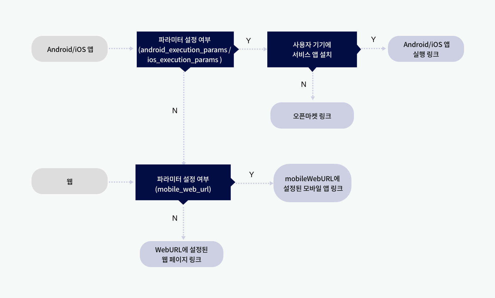
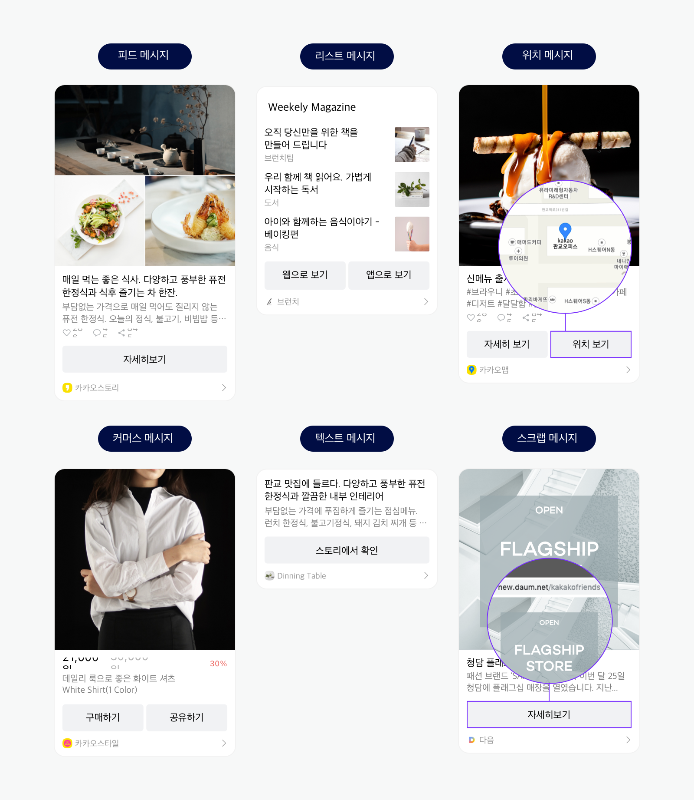
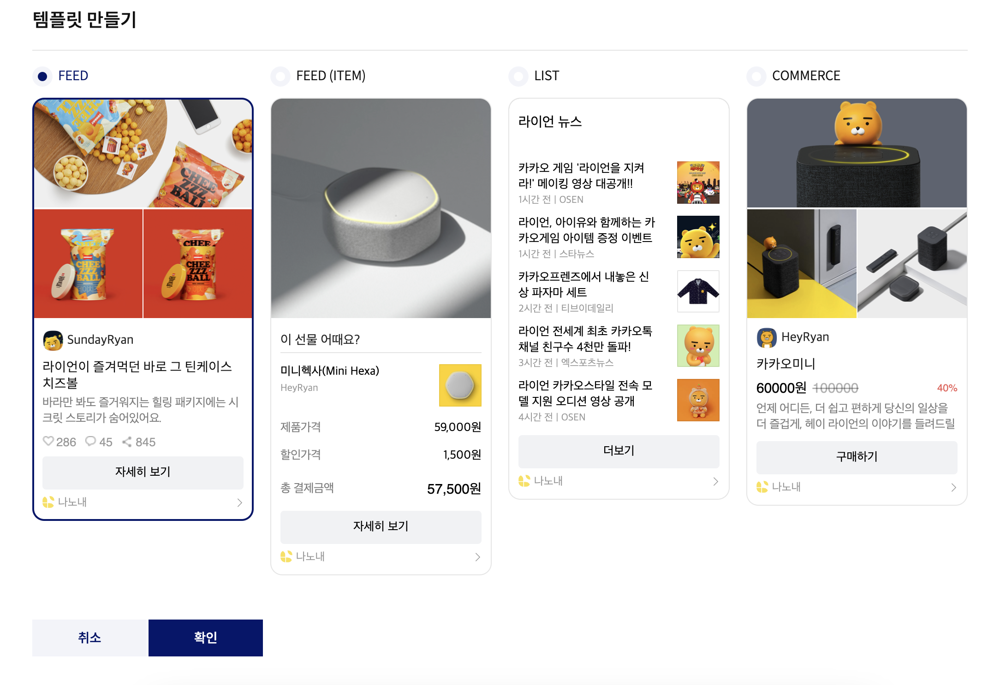
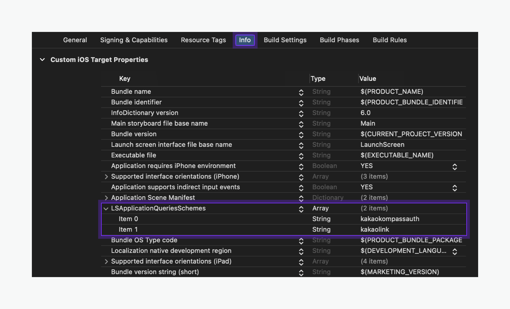
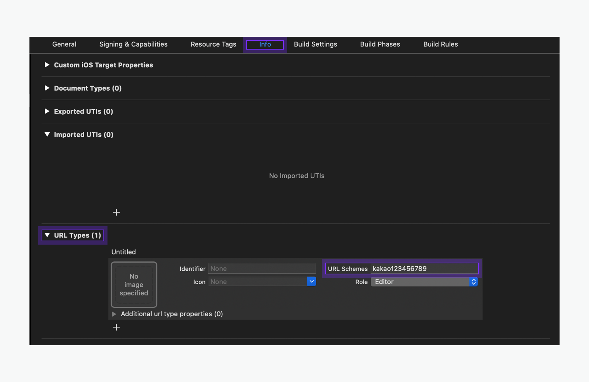

### flutter로 앱을 개발하다보면 공유기능이 필요해질 때가 있습니다. (친구초대 이벤트, 정보 공유 등..)  

사실 개인적으로 한국에서 카카오톡만한 전국민이 쓰는 메신저 어플리케이션이 없고, 단톡방은 그 어느것보다도 효과적인 마케팅 채널이라고 생각하고 있습니다.  
게다가, 카톡에서는 다음과 같이 예쁘게? 공유기능을 제공해주고 있습니다.


원래는 카카오톡 공유 기능을 구현하고 설정하는 방법에 대해 알려주는 튜토리얼 형식의 글을 쓰려고 했으나..  
기존에 너무 잘 써주신 블로그 글이 많고, 카카오톡이 문서화를 워낙 잘 해주어서 주제를 해당 기능을 설정하며 겪었던 문제 해결과정을 적으려 합니다.  
혹시 제가 잘못 알고 있는 내용이 있다면 댓글에 남겨주시면 감사하겠습니다!  

## 카카오톡 딥 링크의 이해

처음에 카카오톡 공유를 도입하겠다! 생각하고 도입하면서, 기존의 내가 갖고있던 생각과 다른점이 있었습니다.
카카오톡 공유가 단순히 '링크'를 전달하는 게 아니라는 점입니다.  
main>AndroidManifset.xml 파일을 보면 application 하위 activity안에 다음과 같이 정의해야 합니다.

```xml
<intent-filter>
    <action android:name="android.intent.action.VIEW" />
    <category android:name="android.intent.category.DEFAULT" />
    <category android:name="android.intent.category.BROWSABLE" />
    <data android:host="kakaolink"
        android:scheme="kakao${kakaoApiKey}" />
</intent-filter>
```
Uri Scheme이 kakao{나의 앱 key}://kakaolink 로 시작하는 링크는 우리 앱의 딥링크로 확인한다는 의미입니다.  

예를 들면 나의 앱 key가 123123이면
kakao123123://kakaolink/~~~~~ 이런식으로 시작하는 Uri는 우리 앱을 실행시키는 것 이지요.  

사실 android native를 개발했더라면, activity 하나하나마다 다른 host로 intent-filter를 설정헤줬어야 했을텐데, flutter를 사용한 덕에 하나의 activity만 사용하게 되었고, 반복적으로 deeplink를 위한 intent-filter를 만들어주지 않아도 되게 되었습니다. (물론 실제로 여러개라면 중간에 후킹하는 activity를 만들어야 합니다.) 


이 코드를 추가하면서 생각한 건, 단순 url을 열어주는 공유기능으로 생각했던 게 사실은 아닐지도 모르겠다는 생각이었습니다.

그리고, 카카오톡 공유 flutter sdk 공식 문서에서 이제까지 못 보았던 한 블록의 코드를 발견하게 됩니다..  
```dart
kakaoSchemeStream.listen((url) {
    // url에 커스텀 URL 스킴이 할당됩니다. 할당된 스킴의 활용 코드를 작성합니다.
}, onError: (e) {
    // 에러 상황의 예외 처리 코드를 작성합니다.
});
```
그리고 이해가 안되던 이 사진을 비로소 이해할 수 있게 되었죠..  



이 사진이 의미하는 것은 카카오톡 공유는 딥 링크의 일종이라는 것 입니다. 
사실 이 사실을 알지 못했었고.. 그 전엔 Firebase의 dynamic link를 이용하여 Uri link를 만들었고, 해당 링크를 kakaotalk 공유로 넣는 방식으로 구현하고 있었습니다. 

이제는 그 사실을 알게 되었으니 다시 구현 해 보겠습니다. 구현 전 선행사항은 다음과 같습니다.

> 1. kakao developer에 내 어플리케이션 추가.
>
> 2. 상황에 맞게  `android` or `ios`플랫폼 추가. 
>
>    (제가 예전에 했던 것 처럼 다른 링크를 쓰신다면 web에 해당 링크의 host를 추가 해 주어야 합니다.)
>
> 3. pubspec.yaml 파일에 `kakao_flutter_sdk` dependency 추가. 

# 메시지 템플릿

 제가 메시지 템플릿에 대해 이해했던 내용으로 짧게 정리 해 보려 합니다.

일단 템플릿의 종류는 다음과 같이 6개가 존재합니다.



공유는 이 6가지의 템플릿 중 하나를 골라서 해당 템플릿의 양식에 맞추어서 공유를 하는 방식입니다. 만약 이 6개로 충분히 만족할 만한 결과가 나오지 않는다면 직접 정의한 템플릿을 사용하면 됩니다.

카카오 디벨로퍼의 [도구] > [메시지 템플릿]에서 사용자 정의 메시지 템플릿을 사전 정의할 수 있습니다. 사용자 정의 템플릿을 등록하고 API 요청 시 등록한 템플릿 ID를 함께 전달하면 원하는 방법으로 공유할 수 있습니다..

하지만 좀 찾아본 결과 큰 틀에서 변화하지는 못하는 것으로 생각됩니다. 4가지의 기본 프레임에서 몇가지를 추가하고 빼는 방식인 듯 합니다.

이 글에서는 기본 템플릿을 이용하는 것으로 설명하도록 하겠습니다!



# 구현

## Android

main > AndroidManifset.xml 파일을 보면 application 하위 activity안에 다음과 같이 정의 해 줍니다.

```xml
<activity
        android:name=".MainActivity"
        <!-- 생략 -->
				>
       

        <intent-filter>
            <action android:name="android.intent.action.VIEW" />
            <category android:name="android.intent.category.DEFAULT" />
            <category android:name="android.intent.category.BROWSABLE" />

            <!-- "kakao${YOUR_NATIVE_APP_KEY}://${PRODUCT_NAME}" 형식의 앱 실행 스킴 설정 -->
            <!-- 카카오톡 공유, 카카오톡 메시지 -->
            <data android:host="kakaolink"
                android:scheme="kakao${YOUR_NATIVE_APP_KEY}" />

        </intent-filter>
    </activity>
```

위에서 딥 링크에 대해 설명 한 것 처럼, 해당 intent-filter가 activity 테그 안에 있어야 정상적으로 카카오톡 공유를 받은 유저가 해당 링크를 클릭 시 어플리케이션으로 자연스럽게 연결될 수 있습니다.

## ios

1. ### 앱 실행 허용 목록 추가

해당 사진은 프로젝트를 xcode로 연 사진입니다. info.plist에서 직접 수정할 수도 있고 xcode에서 추가를 해 주어도 됩니다.



직접 수정하려면 이렇게 하면 됩니다.

```xml
 <key>LSApplicationQueriesSchemes</key>
  <array>
      <!-- 카카오톡으로 로그인 -->
      <string>kakaokompassauth</string>
      <!-- 카카오톡 공유 -->
      <string>kakaolink</string>
      <!-- 카카오톡 채널 -->
      <string>kakaoplus</string>
  </array>
```

> 주의: 앱 실행 허용 목록 설정을 위한 키 변경
>
> Xcode 14 이상일 경우, 앱 실행 허용 목록 설정을 위한 키가 `LSApplicationQueriesSchemes`에서 `Queried URL Schemes`로 자동 변환될 수 있습니다. Info.plist 파일 내부에서는 기존 키를 사용하므로, 해당 파일을 직접 수정할 경우에는 기존 키를 사용합니다.

2. ### URL scheme 설정

이 또한 xcode에서 수정할 수 있습니다. 좌측 패널에서 Runner를 포커싱 한 후 Info탭에서 URL type을 추가 할 수 있습니다.

icon과 Identifier는 따로 설정해 주지 않아도 됩니다. 

하지만 종종 Identifier를 설정 해 주어야 하는 URL type이 있는데, 이는 트래킹을 위해서 설정 해 주어야 하는 것으로 생각됩니다.. (정확한 이유가 뭔지 댓글로 알려주시면 수정하도록 하겠습니다.) 제 짧은 개발 경험으로는 Firebase Dynamic Link와 AB180의 Airbridge Deeplink를 설정 해 줄 때에 필요했습니다.



이렇게 되면 설정은 끝 입니다.


## 코드

Kakao 공유 기능 등을 사용하기 전 init을 해 주어야 합니다. 

> 반드시 `runApp` 메소드 실행 전 init을 해 주어야 합니다!

 ```dart
 WidgetsFlutterBinding.ensureInitialized();
 KakaoSdk.init(nativeAppKey: '${YOUR_NATIVE_APP_KEY}');
 ```

main문 안에 넣으셔도 되고,`runZonedGuarded` 메서드 안에 넣으셔도 됩니다. 중요한 건 초기화를 해 주어야 한다는 점, 시점이 중요하다는 점 입니다.

이후 이용은 자유롭게 하면 됩니다. 

다음처럼 구현 해 보았습니다.

1. `isKakaoTalkSharingAvailable` 메서드로 공유 가능여부 판별.
2. 불가능할 시 `Share`패키지 등의 방법으로 공유.
3. `FeedTemplate` 정의.
4. `shareDefault`로 기본 템플릿 공유 Uri 생성
5. `launchKakaoTalk` 메서드로 카카오톡 공유

```dart
final kakaoAvail = await ShareClient.instance.isKakaoTalkSharingAvailable();
  if (!kakaoAvail) {
    //Share.share...
    return;
  }

  final link = Uri(...)

  final FeedTemplate defaultFeed = FeedTemplate(
    content: Content(
      title: "타이틀",
      description:"설명",
      imageUrl: Uri.parse(''),
      link: Link(webUrl: link, mobileWebUrl: link),
    ),
    buttonTitle: "공유 받기",
  );
  Uri uri = await ShareClient.instance.shareDefault(template: defaultFeed);
  await ShareClient.instance.launchKakaoTalk(uri);
}
```

## 후기

 구현하며 딥링크의 개념에 대해서 다시한번 공부할 수 있었고, 역시 좋은 개발자가 되려면 native지식, 기반 지식의 기본을 알아야 될 수 있겠다는 생각이 들었습니다.

여기까지 읽어주셔서 감사드립니다. 주시는 피드백은 언제나 감사드리고있습니다.
