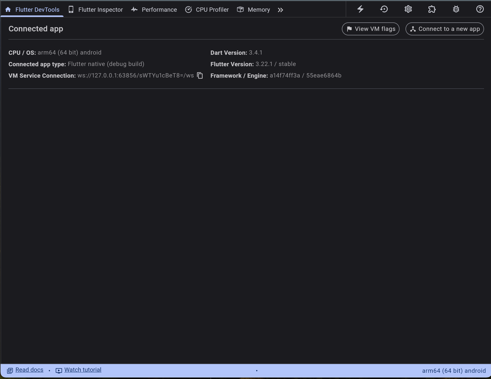
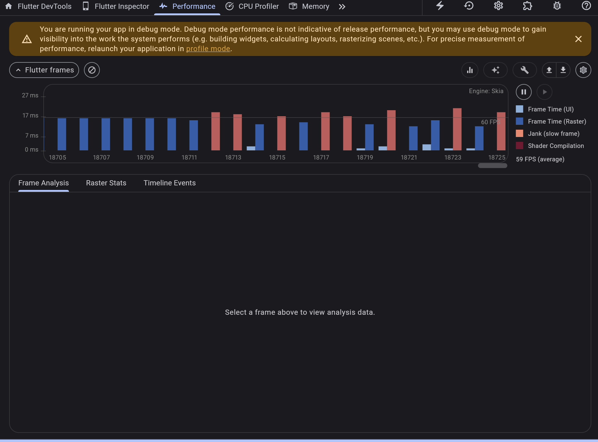

이번 글에서는 flutter 어플리케이션을 개발하며 겪었던 최적화문제와,

그에 대한 해결법들, 팁을 담아봤습니다.

## Profiling하기

먼저 느려지는 화면에서 어떤 부분에서 문제가 발생하는지에 대한 분석이 필요합니다.

vscode 기준 cmd+p (커멘드 팔레트 열기)이후 다음 명령어를 쳐줍니다.

`> Flutter: Open Devtools`

브라우저에서 열만 다음과 같은 화면을 볼 수 있습니다.

`flutter run --profile 을 사용한 후 devtools를 이용하면 더욱 정확한 결과를 얻을 수 있습니다.



이 화면에서 performance 탭으로 들어가면 프레임단위로 어떤 작업이 진행되고 있는지,

어떤 작업이 느려짐을 유발하는지(jank)를 확인할 수 있습니다.

impeller engine으로 flutter가 업데이트 되기 전엔 jank가 상당히 많이 발생했었는데,

업데이트 된 이후로 많이 개선된 모습을 보여주고 있습니다.



지금 jank가 일어나는 부분은 raster임을 확인할 수 있습니다.

raster thread를 사용하는데, jank가 일어난다?

제 경우엔 image, opacity, fadein/out과사용 시에 raster thread를 사용했습니다.

때문에 해당하는 부분을 수정해주면 됩니다.

어떤 부분이 문제인지 모르겠다면, widget tree에서 한두개씩 지워보며 어느 widget에서 느려짐을 유발하는지 확인하는 방법으로도 최적화를 시킬 수 있을 것 같습니다.


## image caching하기

### CachedNetworkImage패키지

해당 패키지를 사용하면 network 리소스를 줄일 수 있습니다.

> [https://pub.dev/packages/cached_network_image](https://pub.dev/packages/cached_network_image)

만.. 화면상에 고해상도의 이미지가 수십장이 렌더링이 되어야 하는 경우 jank가 발생합니다.

때문에 caching할때 내 화면의 pixelRatio를 고려해서 caching을 시켜야 합니다.

### memCacheHeight, memCacheWidth

제 경우, 이 파라미터를 적절하게 사용해 줄 경우, 속도가 현저하게! 빨라졌습니다.

```dart
// cacheHeight와 cacheWidth를 실제 사용하는 크기로 설정해줍니다.
// double get getDevicePixelRatio => MediaQuery.of(this).devicePixelRatio; 이렇게 extension을 이용했습니다.
  
CachedNetworkImage(
  memCacheHeight: (cacheHeight * context.getDevicePixelRatio).floor(),
  memCacheWidth: (cacheWidth * context.getDevicePixelRatio).floor(),
 );
```


## Opacity 사용 줄이기


## lazy build하기


## Clip 줄이기

clip에 대한 내용은 다음 글에 더 자세히 담았습니다!

[Clip이 뭐지? Clipbehavior 등](/flutter_whatisclip/)


## IntrinsicHeight 및 IntrinsicWidth 사용 줄이기

앱 개발을 하다 보면, 때때로 무한히 확장될 수 있는 위젯의 크기를 조절하고 싶을 때가 있습니다.

어떤 경우냐면, `Row` 안에 2개의 child가 있다고 생각해봅시다.

두번째의 child의 높이가 첫번째 child의 높이와 정확히 일치하게 만들고 싶을 수 있습니다.

그리고 그 첫번째 child의 높이는 동적이고 내가 정확히 높이를 정의할 수 없을때 문제가 발생하죠.

이때,  `Row`의 두번째 child에 IntrinsicHeight를 사용할 수 있습니다.

### IntrinsicHeight

`IntrinsicHeight`은 높이를 계산하기 위해 추가적인 레이아웃 패스를 수행하기 때문에 비용이 많이 듭니다.

특히, 트리의 깊이가 깊어질수록 최악의 경우 O(N²) 성능 저하를 유발할 수 있다고 합니다.

>  [https://api.flutter.dev/flutter/widgets/IntrinsicWidth-class.html](https://api.flutter.dev/flutter/widgets/IntrinsicWidth-class.html)

### IntrinsicWidth

`IntrinsicWidth`도 마찬가지입니다.

최대한 사용을 줄여주는 게 최적화에 용이합니다.


---

더 좋은 최적화 기법이 있다면 댓글로 달아주시면 감사하겠습니다!
