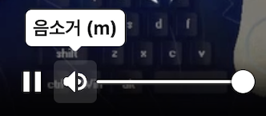

flutter로 개발 하다 보면 특정 상황에서 다른 widget보다 위에 위젯이 있어야 하거나,

전체 화면중에서 가장 위에 위젯이 있어야 하는 상황이 종종 발생합니다.

예를 들면 popup, tooltip, 알림 등이 있습니다.

그 때 사용하는것이 overlay입니다.

ovelay는 buildcontext에서 삽입되는것이 아니라, overlaystate에서 삽입됩니다.

`Overlay.of(context)`로 접근 가능합니다.

 **Overlay**,  **OverlayEntry** 이 두가지를 이용하여 간단한 overlay를 띄우는 방법과,

**CompositedTransformTarget**, **CompositedTransformFollower**, **OverlayPortal**

 이 세가지를 이용하여 다소 복잡한 overlay를 띄우는 방법에 대해서 알아보겠습니다.


## Overlay, OverlayEntry

> 예시는 `go_router: ^12.1.1` 를 사용하여 구현하였습니다.

구현하고자 하는 효과는 다음과 같습니다.

- 특정 시간이 지나면 overlay가 사라져야 함.
- overlay에는 단순한 string을 입력하여 보여줄 수 있어야 함.
- 동시에 여러개의 overlay를 보여주더라도 오류가 없어야 함.
- overlay가 닫히기까지를 future로 받아볼 수 있어야 함.


해당 효과를 구현하기 위해서 overlayEntry를 overlayState에 insert하고,

특정 시간이 지나면 해당 overlayEntry를 remove하게 합니다.

future로 overlay가 닫히기까지를 받아보기 위해서 Completer로 동시에 기용하였습니다.

```dart
class SimpleNotify {
  Future<void> show(String text) async {
    final completer = Completer();
    OverlayEntry? entry;
    entry = OverlayEntry(
      builder: (_) {
        return _SimpleNotifyContainer(
          text: text,
          duration: const Duration(seconds: 2),
          onRemoved: () {
            entry?.remove();
            completer.complete();
          },
        );
      },
    );
		final goRouter = [Dependency Injection으로 주입해 놓은 instance를 받아옵니다.]
		goRouter.overlayState?.insert(entry);
    return completer.future;
  }
}

```

차례차례 순서를 짚어보면,

1. OverlayEntry를 만들어 줍니다. builder 메서드는 widget을 return합니다.
2. OverlayState를 받아와서 만들어 준 entry를 insert 해 줍니다.
3. completer를 widget에 넘겨 주고, widget에서는 remove 될 때 completer를 complete해 주고, show에서는 completer의 future를 return해 줍니다.


`_SimpleNotifyContainer` 는 statefulwidget으로, 다음과 같이 구현했습니다.

```dart
class _SimpleNotifyContainer extends StatefulWidget {
  const _SimpleNotifyContainer({
    required this.text,
    required this.duration,
    required this.onRemoved,
  });

  final String text;
  final Duration duration;
  final VoidCallback? onRemoved;

  @override
  _SimpleNotifyState createState() => _SimpleNotifyState();
}

class _SimpleNotifyState extends State<_SimpleNotifyContainer> {
  final positionKey = GlobalKey();
  bool isVisible = false;

  @override
  void initState() {
    Future.delayed(const Duration(milliseconds: 1), () {
      setState(() => isVisible = true);
    });
    Future.delayed(widget.duration, () {
      setState(() => isVisible = false);
      Future.delayed(const Duration(milliseconds: 300), () {
        widget.onRemoved?.call();
      });
    });

    super.initState();
  }

  @override
  Widget build(BuildContext context) {
    var width = 34 + widget.text.length * 14.0;

    if (width > context.getWidth - 34) {
      width = context.getWidth - 34;
    }
    return Center(
      key: positionKey,
      child: AnimatedOpacity(
        opacity: isVisible ? 1 : 0,
        curve: Curves.easeInOutQuart,
        duration: const Duration(milliseconds: 300),
        child: Material(
          color: Colors.transparent,
          borderRadius: BorderRadius.circular(5),
          child: Wrap(
            children: [
              Container(
                margin: const EdgeInsets.symmetric(horizontal: 17),
                width: width,
                padding: const EdgeInsets.symmetric(
                  horizontal: 17,
                  vertical: 8,
                ),
                decoration: BoxDecoration(
                  color: Colors.black,
                  borderRadius: BorderRadius.circular(5),
                  boxShadow: [
                    BoxShadow(
                      color: Colors.white.withOpacity(0.3),
                      blurRadius: 10,
                      offset: const Offset(0, 1),
                    ),
                  ],
                ),
                child: Center(
                  child: Text(
                    widget.text,
                    style: const TextStyle(color: Colors.white),
                    textAlign: TextAlign.center,
                  ),
                ),
              ),
            ],
          ),
        ),
      ),
    );
  }
}

```


핵심적인 부분은 state와 initState입니다.

```dart
  final positionKey = GlobalKey();
  bool isVisible = false; 

  @override
  void initState() {
    Future.delayed(const Duration(milliseconds: 1), () {
      setState(() => isVisible = true);
    });
    Future.delayed(widget.duration, () {
      setState(() => isVisible = false);
      Future.delayed(const Duration(milliseconds: 300), () {
        widget.onRemoved?.call();
      });
    });

    super.initState();
  }
```

1. fadeIn되는 효과를 위해서 isVisible을 처음에는 false, 직후 isVisible을 true로 해 주었습니다.
2. 지정한 duration 이후에 isVisible을 false로 해 주고
3. 300ms뒤에 onRemoved 메서드를 호출 해 주 었습니다.(300ms는 fadeout까지의 시간입니다.)

이 방법으로 원하는 요구사항을 만족하는 overlay를 구현할 수 있었습니다.


## **CompositedTransformTarget**, **CompositedTransformFollower**, **OverlayPortal**

### CompositedTransformTarget

해당 위젯은 다음과 같이 정의됩니다.

```dart
CompositedTransformTarget CompositedTransformTarget({
  Key? key,
  required LayerLink link,
  Widget? child,
})
```

이 위젯은 `CompositedTransformFollower`와 함께해야 진짜 진가를 발휘하는데, Follower가 따라다녀야 할 Target을 정의 해 주는 위젯이기 때문입니다.

Overlay는 기존 위젯 트리에서 벗어난 곳에서 생성되는데, 그렇게 되었을 때 overlay가 기존 위젯 트리의 특정 위젯 위치에 생성하게 하는게 어려운 일이기 때문에 해당 위젯을 사용해주어야 합니다.

이걸 사용하지 않는다면.. `GlobalKey`를 생성해 위젯의 위치를 알고싶은 위젯에 key로 넣어주고 렌더링 후 실제 렌더링된 위치가 어디인지 해당 key의 context를 이용해서 구하면 overlay도 해당하는 위치에 띄울수는 있습니다.

하지만 이 위젯은 같은 `link`로 이어져있는 `CompositedTransformFollower`위젯과 위치를 연동할 수 있습니다.

### CompositedTransformFollower

해당 위젯은 다음과 같이 정의됩니다.

```dart
CompositedTransformFollower CompositedTransformFollower({
  Key? key,
  required LayerLink link,
  bool showWhenUnlinked = true,
  Offset offset = Offset.zero,
  Alignment targetAnchor = Alignment.topLeft,
  Alignment followerAnchor = Alignment.topLeft,
  Widget? child,
})
```

Target과는 다른 파라미터들이 눈에 띕니다.

link는 원하는 target과 같은 link를 공유해주고, targetAnchor와 followerAnchor, 그리고 child의 적절한 align을 통해서 원하는 위치에 overlay 위젯을 연동할 수 있습니다.

### OverlayPortal

해당 위젯은 다음과 같이 정의됩니다

```dart
OverlayPortal OverlayPortal({
  Key? key,
  required OverlayPortalController controller,
  required Widget Function(BuildContext) overlayChildBuilder,
  Widget? child,
})
```

overlay를 만들 수 있는 유용한 위젯인데, overlayChildBuilder에 내가 원하는 overlay 위젯 빌더를 넣고, controller를 통해서 해당 overlay를 보이게/안보이게 조정할 수 있습니다.

### 종합

이 세가지 위젯을 이용하면 원하는 위치에 적절한 overlay를 띄울 수 있는 기능을 구현할 수 있습니다.

제 경우에는 커스텀 동영상 플레이어를 구현하는데,

flutter web 기준으로 마우스를 볼륨 아이콘 위에 올려놓았을 때 볼륨을 조정할 수 있는 overlay를 볼륨 아이콘 위에 띄우는 기능을 구현하고 싶었습니다.

또한, 볼륨 아이콘 클릭시 음소거를 하는 일반적인 uiux를 구현하고자 했습니다. 



그래서 해당하는 위젯을 구현하기 위한 일반적인 클래스를 구현하고자 했고, 코드는 아래 첨부하도록 하겠습니다.

```dart
import 'package:flutter/material.dart';

enum EOverlayPortalType {
  onHover,
  onTap,
  alwaysVisible,
}

enum EOverlayPortalPosition {
  topCenter,
  topRight,
  topLeft,
  bottomCenter,
  bottomRight,
  bottomLeft,
}

extension EOverlayPortalPositionX on EOverlayPortalPosition {
  Alignment get targetAnchor => switch (this) {
        EOverlayPortalPosition.topCenter => Alignment.bottomCenter,
        EOverlayPortalPosition.topRight => Alignment.bottomRight,
        EOverlayPortalPosition.topLeft => Alignment.bottomLeft,
        EOverlayPortalPosition.bottomCenter => Alignment.topCenter,
        EOverlayPortalPosition.bottomRight => Alignment.topRight,
        EOverlayPortalPosition.bottomLeft => Alignment.topLeft,
      };
  Alignment get followerAnchor => switch (this) {
        EOverlayPortalPosition.topCenter => Alignment.topCenter,
        EOverlayPortalPosition.topRight => Alignment.topRight,
        EOverlayPortalPosition.topLeft => Alignment.topLeft,
        EOverlayPortalPosition.bottomCenter => Alignment.bottomCenter,
        EOverlayPortalPosition.bottomRight => Alignment.bottomRight,
        EOverlayPortalPosition.bottomLeft => Alignment.bottomLeft,
      };
  Alignment get alignment => switch (this) {
        EOverlayPortalPosition.topCenter => Alignment.topCenter,
        EOverlayPortalPosition.topRight => Alignment.topRight,
        EOverlayPortalPosition.topLeft => Alignment.topLeft,
        EOverlayPortalPosition.bottomCenter => Alignment.bottomCenter,
        EOverlayPortalPosition.bottomRight => Alignment.bottomRight,
        EOverlayPortalPosition.bottomLeft => Alignment.bottomLeft,
      };
}

class EOverlayPortal extends StatefulWidget {
  const EOverlayPortal({
    Key? key,
    required this.type,
    required this.position,
    required this.overlayChildBuilder,
    required this.child,
    this.onHover,
    this.hideOnBarrierTap = true,
    this.inkwellBorderRadius = 0,
  }) : super(key: key);

  final EOverlayPortalType type;
  final EOverlayPortalPosition position;
  final Widget Function(BuildContext context) overlayChildBuilder;
  final Widget child;

  final Function(bool)? onHover;
  final bool hideOnBarrierTap;
  final double inkwellBorderRadius;

  @override
  State<EOverlayPortal> createState() => _EOverlayPortalState();
}

class _EOverlayPortalState extends State<EOverlayPortal> {
  final _controller = OverlayPortalController();
  final _link = LayerLink();
  bool _isHover = false;

  @override
  void initState() {
    super.initState();
    if (widget.type == EOverlayPortalType.alwaysVisible) _controller.show();
  }

  @override
  Widget build(BuildContext context) {
    return CompositedTransformTarget(
      link: _link,
      child: OverlayPortal(
        controller: _controller,
        overlayChildBuilder: (_) {
          return Stack(
            children: [
              if (widget.hideOnBarrierTap &&
                  widget.type != EOverlayPortalType.onHover)
                Positioned.fill(
                  child: GestureDetector(
                    onTap: () => _controller.hide(),
                    child: Container(
                      color: Colors.transparent,
                    ),
                  ),
                ),
              CompositedTransformFollower(
                link: _link,
                targetAnchor: widget.position.targetAnchor,
                followerAnchor: widget.position.followerAnchor,
                child: Align(
                  alignment: widget.position.alignment,
                  child: widget.overlayChildBuilder(context),
                ),
              ),
            ],
          );
        },
        child: switch (widget.type) {
          EOverlayPortalType.onHover => MouseRegion(
              onHover: (_) {
                if (_isHover) return;
                _isHover = true;
                widget.onHover?.call(true);
                _controller.show();
              },
              onExit: (_) {
                if (!_isHover) return;
                _isHover = false;
                widget.onHover?.call(false);
                _controller.hide();
              },
              child: widget.child,
            ),
          EOverlayPortalType.onTap => InkWell(
              borderRadius: BorderRadius.circular(
                widget.inkwellBorderRadius,
              ),
              onTap: () => _controller.toggle(),
              onHover: widget.onHover,
              child: widget.child,
            ),
          EOverlayPortalType.alwaysVisible => widget.child,
        },
      ),
    );
  }
}

```


## EOverlayPortal

```dart
enum EOverlayPortalType {
  onHover,
  onTap,
  alwaysVisible,
}
```

타입을 세가지로 분류했습니다.

1. 마우스를 child 위젯에 hover했을 경우 overlay를 띄우기
2. 마우스로 child 위젯을 클릭했을 경우 overlay를 띄우기
3. 항상 overlay를 띄우기

```dart
enum EOverlayPortalPosition {
  topCenter,
  topRight,
  topLeft,
  bottomCenter,
  bottomRight,
  bottomLeft,
}
```

overlay가 위치할 수 있는 타입도 6가지로 분류했습니다.

해당하는 위치에 overlay가 위치하게 됩니다.

```dart
final EOverlayPortalType type;
final EOverlayPortalPosition position;
final Widget Function(BuildContext context) overlayChildBuilder;
final Widget child;

final Function(bool)? onHover;
final bool hideOnBarrierTap;
final double inkwellBorderRadius;
```

7가지의 parameter가 있으며 child와 overlay, 그리고 커스터마이징 할 수 있는 몇가지의 parameter를 추가했습니다.

전체적인 구조는 

CompositedTransformTarget 안에 OverlayPortal,

OverlayPortal의 overlayBuilder 안에 CompositedTransformFollower가 위치하고 있는 형태입니다.


---

overlayEntry를 이용한 overlay부터 자유롭게 사용 가능한 커스텀 overlay를 구현하기까지의 과정이었습니다.

부족한 점이 있다면 언제든 댓글 부탁드립니다.
