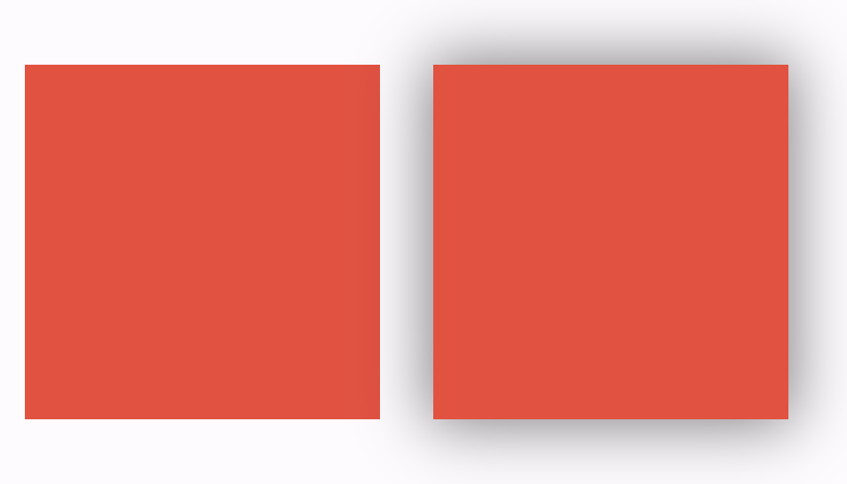

## Clip?

Clip이라는 용어를 처음 들었을 때 떠올랐던 건 문서를 정리하는데 쓰이는 클립이었습니다.


이후 개발을 해 가면서 이미지의 가장자리를 둥글게 만들어야 할 일이 있었고, 

ClipRRect위젯을 이용하며, 아! 클립이 자르는 걸 의미하는 느낌이구나 라는 걸 알게 되었습니다. 

아마 아래의 뜻 중 4번의 의미로 쓰이는 느낌이었지요.


더 개발을 해가며 ClipBehavior, CustomClip 등등을 변경하고 구현해보면서,

Stack에서 children의 그림자가 왜 잘릴까 생각해보면서, 점차 clip 뭔지 궁금해지기 시작해서 공부해보고 글을 정리 해 보았습니다.


## Clip의 의미

Computer graphics에서 Rendering 하는 행위를 특정 구역으로 제한하는 것을 Clipping이라고 부른다고 합니다.

Flutter에서는 위젯을 렌더링할 때 부모와 자식 개념이 존재하고, 자식 위젯이 부모 위젯보다 커지는 경우, 
혹은 자식 위젯이 그림자나 블러 등 특별한 효과를 가질 때 clip이 필요한 것 입니다.

그래서 ClipRRect등의 clipping을 사용하는 위젯에서 shadow가 있을 때,

 부모 위젯의 크기에 따라서 그림자가 잘리거나,

 때론 잘리지 않거나 하는 문제가 발생했던 것이었습니다.



좌측은 ClipRect를 적용한 Container, 우측은 Clip이 없는 Container. 두 container모두 아래의 코드로 작성되었습니다.

```dart
Container(
    height: 200,
    width: 200,
    decoration: BoxDecoration(
      color: Colors.red,
      boxShadow: [
        BoxShadow(
          color: Colors.black.withOpacity(0.5),
          spreadRadius: 3,
          blurRadius: 30,
          offset: const Offset(0, 0),
        ),
      ],
    ),
  );
```

또, Clip은 곡선을 만들때 사용되기도 합니다.

종종 네모난 이미지나 위젯의 가장자리를 깎아 둥글게 만들어 주어야 할 때가 있습니다. 

이럴 때 ClipRRect를 이용해서 구현할 수 있습니다.


## ClipBehavior의 변경점.

Flutter 2.0 이전에는 상당수의 위젯에서 Clip을 사용했다고 합니다. 

하지만 Clip을 사용하는것은 앱의 렌더링 성능을 크게 떨어뜨리고 있었습니다. 그 이유는 다음과 같았습니다.


### 과도한 saveLayer로 인한 성능저하

그 이전에는 Clip을 할 때 bleeding edge artifacts 문제를 해결하기 위해서 saveLayer를 사용했는데, 

saveLayer 호출은 offscreen render target을 생성하고, 렌더 스크린 전환은 때때로 약 1밀리초의 비용이 들었다는 점 입니다.


bleeding edge artifacts문제는 위의 사진으로 설명할 수 있는데, 

자세히 들여다 보면 빨간색 테두리가 검정색 네모를 둘러싸고 있는 게 보입니다.

하지만 코드상으로는 해당 빨간색 빨간색 테두리는 rendering 되지 않아야 합니다.

부동소수점 오류 + 디바이스마다 픽셀의 밀도가 달라 생기는 오차 = bleeding edge artifacts 문제

렌더링이 의도와 다르게 되는 문제라고 할 수 있겠습니다.


flutter 팀은 이 문제를 해결하기위해서 렌더링 도중에 렌더링 하던 상태를 저장하고,

별도의 rendering 타겟(offscreen render target)을 생성하여 렌더링한 후 해당 타겟을 원래 렌더링 하던 타겟에 병합하는 방식으로

구현했다고 합니다. 이 과정이 구형 기기에선 큰 성능저하를 일으켰고 때떄로 1ms초의 비용이 들었는데

60fps가 나오기 위해선 약  16.7ms안에 렌더링이 끝나야 하니.. 굉장히 큰 비용이라고 볼 수 있었습니다.


### Clipping 자체의 성능 저하

saveLayer 호출 없이도 clipping은 여전히 비용이 많이 듭니다.

왜냐하면 이는 복원될 때까지 모든 하위의 drawing에 적용되기 때문입니다.

따라서 내가 Clipping을 한번만 수행해도, 수백 개의 drawing에서 성능을 저하시킬 수 있는 문제가 있었습니다.


### Clipping 통합과 기본 Clipbehavior 변경

위에 서술한 문제들 이외에도 clip이 위젯마다 따로 관리되는 문제가 있었기 때문에 전체적으로 통합하고

성능 향상을 위해 clip을 사용하지 않는 방법으로 구현될 수 있다면 해당 방식으로 구현하며 flutter 2.0 이후부터

다음 경우를 제외하면 대부분의 위젯에서 Clip.none으로 설정되었습니다.

```
- ClipPath defaults to Clip.antiAlias
- ClipRRect defaults to Clip.antiAlias
- ClipRect defaults to Clip.hardEdge
- Stack defaults to Clip.hardEdge
- EditableText defaults to Clip.hardEdge
- ListWheelScrollView defaults to Clip.hardEdge
- SingleChildScrollView defaults to Clip.hardEdge
- NestedScrollView defaults to Clip.hardEdge
- ShrinkWrappingViewport defaults to Clip.hardEdge
```

이상의 위젯은 기본적으로 clip을 수행하기 때문에 성능 향상을 꿈꾸고있다면..

해당 위젯들을 최소화 하는 것을 추천합니다.


## Clip의 종류

### Clipbehavior의 종류

위의 위젯들에서 hardEdge, antiAlias등이 눈에 띄었습니다. 

어떤 경우에 어떤 clipbehavior를 사용해야 할까요?

- 작은 곡선이 필요하다면 

  ```
  Clip.hardEdge
  ```

- 부드러운 곡선이 필요하다면

  ```
  Clip.antiAlias
  ```

- 예전과 같은(saveLayer를 사용하는) 곡선이 필요하다면 -> 이 상황은 피하는 것이 좋습니다.

  - 위에 상술한 bleeding edge artifacts문제를 피해야 하는 경우.

  ```
  Clip.antiAliasWithSaveLayer
  ```

  를 사용하면 됩니다.


### Clip Widget

Flutter에서 개발자들이 주로 사용하는 clip을 구현해서 사용하기 쉽게 CustomClipper를 상속해서 만들어 준 4개의 위젯이 있습니다.

`ClipRect` `ClipRRect` `ClipOval` `ClipPath` 입니다. 

- ClipRect

  - 사각형으로 잘라줍니다.

  - 이 글의 맨 첫 사진처럼 painting 할 구역을 한정하는 느낌입니다.

  - ``` dart
    ClipRect(
      child:  Image.network("https://picsum.photos/id/237/200/300"),
    ),
    ```

- ClipRRect

  - 둥근 모서리로 잘라줍니다.

  - raidus인자로 받아 이미지의 모서리를 깎을 때 등, 다양하게 사용할 수 있습니다.

  - ```dart
    ClipRRect(
      borderRadius: BorderRadius.only(
        topLeft: Radius.circular(25.0),
        topRight: Radius.circular(25.0),
        bottomRight: Radius.circular(25.0),
      ),
      child: Image.network("https://picsum.photos/id/237/200/300"),
    )
    ```

- ClipOval

  - 원 모양으로 잘라줍니다.

  - 원 모양으로 painting 할 구역을 한정합니다.

  - ```dart
    ClipOval(
      child: Container(
        height: 200,
        width: 200,
        decoration: BoxDecoration(
          color: Colors.red,
        ),
      ),
    )
    ```

  - 

  - 무조건 원 모양으로 잘리는 게 아니라 가로세로 크기가 같지 않으면 타원형으로 잘립니다.

- ClipPath

  - path를 주면 path 모양으로 잘라줍니다.

  - path를 주지 않으면 ClipRect와 동일하게 작동하나, ClipRect가 더 효율적입니다.

  - ```dart
    ClipPath(
      child: Container(
        height: 200,
        width: 200,
        decoration: BoxDecoration(
          color: Colors.red,
        ),
      ),
    );
    ```

### CustomClipper

위의 4개의 clip widget으로도 원하는 결과를 얻지못할때도 있을 수 있습니다.

그럴 때 사용하는 것이 CustomClipper 를 상속하여 직접 클래스를 작성하는 것입니다.

CustomClipper를 상속하면 반드시 2개의 함수를 override해야합니다.

```dart
class CustomRect extends CustomClipper<Rect> {
  @override
  Rect getClip(Size size) {
    throw UnimplementedError();
  }

  @override
  bool shouldReclip(covariant CustomClipper<Rect> oldClipper) {
    throw UnimplementedError();
  }
}

```

`getClip`, `shouldReclip`이 그 주인공입니다.

> override 하는 함수들의 type들도 generic type에 따라 바뀌기 때문에 
>
> CustomClipper의 generic type을 지정하는것을 항상 조심해야합니다. 

- getClip
  - 인자로 오는 size는 렌더링되는 renderbox의 size입니다.
  - 이 size와 내가 원하는 clip을 짬뽕해서 Rect를 return해 주면 됩니다.
- shouldReclip
  - clipper delegate가 변경되었을 때 clip을 다시 할 것인지 안할것인지 판단하는 함수입니다.
  - 만약 customRect 클래스가 다른 속성을 가지고, 속성이 변경될 때 마다 clip을 다르게 하길 원한다면
  - oldClipper의 해당 속성과의 비교를 통해서 다시 reclip할지를 정해준다고 생각하면 됩니다.


## 결론

 clip이 뭔지 궁금해하는 것 부터 시작해서, clip behavior가 어떻게 바뀌었는지, 왜 clip하는데 비용이 비싼지 알아보고

clip을 사용하는 예시도 알아보는 글 이었습니다. 읽어주셔서 감사합니다.
