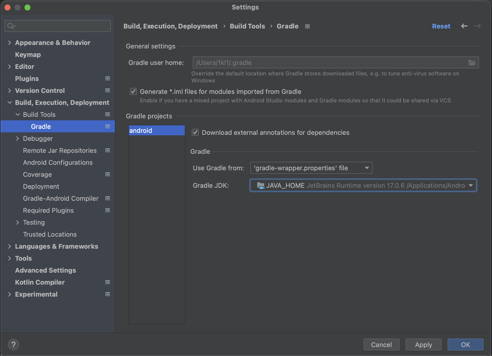
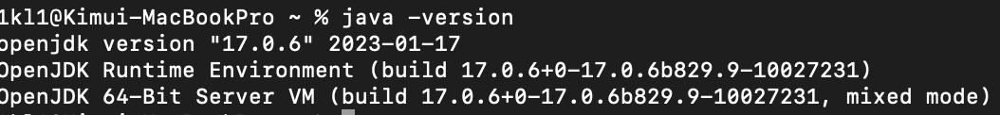

Android를 빌드할 땐 서명할 때 사용하는 keystore가 있습니다.

이전 글인 카카오톡 로그인을 구현할 때 keyhash를 추출하는 방법도 일부 소개했었는데

playstore에 제출할 때 또 keyhash를 다룰 일이 있었고, 이번에 발생했던 문제와 해결방법을 정리해 보았습니다.


### 기본 keyhash 추출

debug keystore같은 경우는 보통 이 명령어를 통해서 추출합니다. 

```shell
keytool -exportcert -alias androiddebugkey -keystore ~/.android/debug.keystore -storepass android -keypass android | openssl sha1 -binary | openssl base64
```


여기서,  `|`  기호는 쉘에서 pipe입니다.

A | B | C가 호출된다면 A의 stdout을 B가 stdin으로 읽어오고 C 도 마찬가지로 동작하게 됩니다.

```shell
keytool -exportcert -alias androiddebugkey -keystore ~/.android/debug.keystore -storepass android -keypass android
# keytool 명령어의 결과가 openssl 명령어의 stdin으로 이어집니다.
openssl sha1 -binary
# ketool>openssl을 거친 명령어의 결과가 openssl base64로 이어집니다
openssl base64
```

두번째 줄의 sha1은 해시 함수를 실행해 주는 명령어로, 임의의 길이의 데이터를 입력받아 160비트의 고정된 길이 해시 값을 출력 해 줍니다.

고로, keytool에서 문제가 생기던 말던, 어떤 버그를 출력하던 말던 일단 output의 형태가 hash형태라는 의미입니다.

그래서, pipe를 사용하면 결과로 나온 hash값이 실제로 내가 원했던 hash값인지 아닌지 알 수 없었습니다.


### keytool 오류: java.io.IOException: Invalid keystore format

debugging모드에서 카카오톡 로그인이 잘 되었지만 release모드로는 카카오톡 로그인이 안되어서 pipe를 떼고 각각 실행시켜 얻었던 오류입니다.

이 문제는 jdk 11로 생성한 key를 jdk 8 이하 버전을 사용해서 서명할 경우 해당 오류가 발생합니다.


제 경우는 android studio 설정이 다음과 같이 되어있었습니다.




그리고 terminal에서 keytool 명령어를 사용하면 동작하는 jdk 버전(path에 등록된 jdk)은 아래 사진에 강조한 버전이었습니다.


terminal에 `java --version`을 입력해도 확인할 수 있습니다.

아무튼, 버전의 차이가 있어서 `keytool 오류: java.io.IOException: Invalid keystore format` 오류를 겪었습니다.

그래서 jdk8을 사용하던 이전 설정 대신 jbr-17을 사용하게 변경 해 주었습니다.


### java path 설정

우선, ~에 .zsh_profile에 작성중인 쉘 프로파일이 있어 해당 파일에 이어 붙여넣기 했습니다.

`sudo nano ~/.zsh_profile`을 입력하고

```shell
JAVA_HOME=/Applications/Android\ Studio.app/Contents/jbr/Contents/Home
export JAVA_HOME
export PATH="$PATH:$JAVA_HOME/bin"
```

해당 스크립트를 더 붙여 넣어주었습니다.

이후 `source .zsh_profile` 을 입력해주면 됩니다.



바뀐 버전을 확인하면 설정 완료입니다.


## 결론

이제껏 개발해온 경험들을 생각해 보면, 사람마다 사용하는 os도 다르고 기존에 설치해 온 프로그램들도 달라

똑같은 걸 따라 하는데도 나는 안되어서 애먹는 경우가 꽤나 많았던 것 같습니다. 명령어 하나하나가 어떤 의미인지 알아가며

문제의 근원을 찾아나가는 것은 어려운 일이지만 실력 향상에는 크게 도움이 된다고 생각하고 있습니다.
