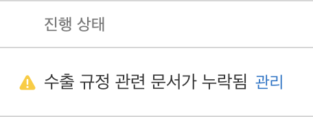

해당 메시지가 appstore에 등록 시 나올 때가 있다.

info.plist에 다음 내용을 추가해주면 문제가 해결된다.

```
<key>ITSAppUsesNonExemptEncryption</key>
<false/>
```

규정 관련해서 수출 규정에 통제를 받는 앱이라면 해당 옵션을 설정하지 않고 appstore에서 등록 해 주어야 한다.

> HTTPS를 사용하거나 로그인 정보를 암호화한 앱

이라면 대부분의 상황에서 false로 설정하고 넘어가도 된다.
