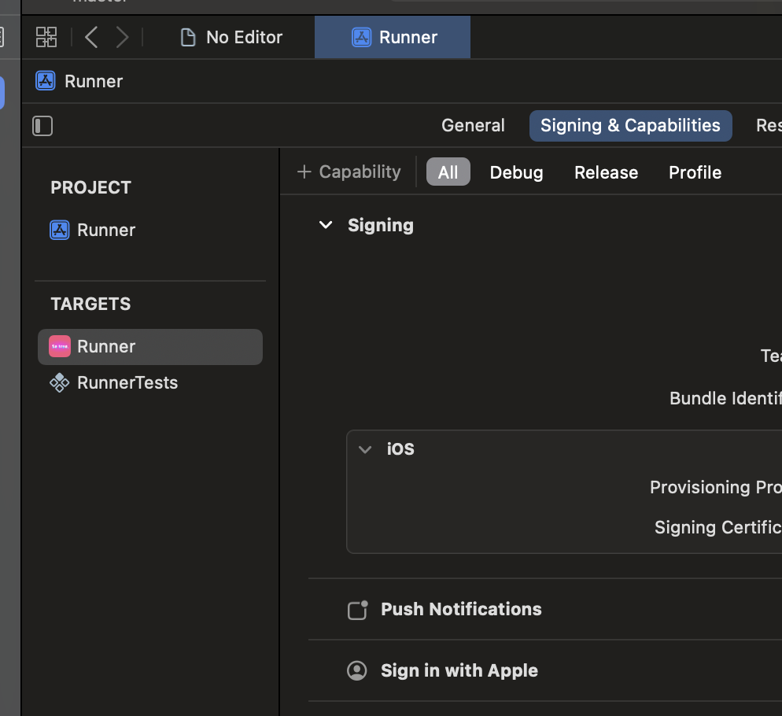

---
title:ITMS-90078. Missing Push Notification Entitlement 해결
date: 2024-07-17 00:00:00
categories: [개발, flutter, ios]
tags: [개발, flutter, ios]
description: Flutter에서 ios appstore issue 해결

---

**ITMS-90078: Missing Push Notification Entitlement**

해당 issue로 이메일이 왔습니다. 

앱에서는 push notification을 쓰지 않는데 무슨일이지 했는데,

사용중인 package 중 에서 해당 comatibility가 필요한 패키지가 있을 수도 있다고 합니다.

심사 reject되기 전에 얼른 문제를 해결 해 주었습니다.

\+ compatibility 버튼을 누른 후

추가해주면 해결입니다.