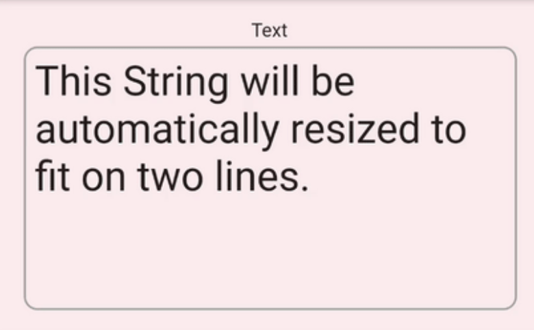
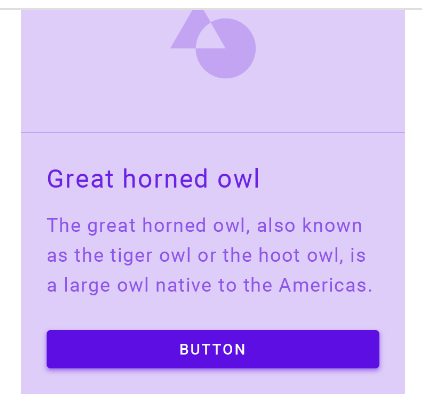
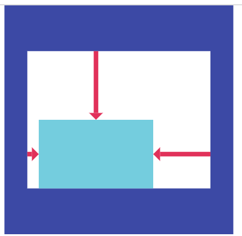

[TOC]


# Basic widgets


## Scaffold

Material Design의 기본 구조를 이루고, child에 Material context를 전달 해 줍니다.

> **Material Context**?
>
> 기본 버튼의 크기, 폰트의 크기, 색깔 등을 사전에 정의하지 않아도 기본 값을 사용할 수 있게 해 주는 일종의 맥락.


```dart
Scaffold(
  appBar: AppBar(
    title: const Text('Sample Code'),
  ),
  body: Center(child: Text('You have pressed the button $_count times.')),
  floatingActionButton: FloatingActionButton(
    onPressed: () => setState(() => _count++),
    tooltip: 'Increment Counter',
    child: const Icon(Icons.add),
  ),
);
```

- appbar, bottom sheet, drawer, FloatingActionButton 등을 지원 해 줍니다. 


## Appbar


```dart
Scaffold(
  appBar: AppBar(
    title: Text("I'm a title"),
  ),
);
```

- Scaffold에 appBar로 사용할 수 있습니다.
  - leading
  - actions
  - title


## Text



```dart
Text('Hello, how are you?',
   overflow: TextOverflow.ellipsis,
);
```

- overflow
- maxLine
- textAlign
- textStyle


## Icon


```dart
Icon(Icons.favorite, color: Colors.red);
Icon(Icons.home, size:20);
```

- https://fonts.google.com/icons
- 라이선스 상업적 이용 가능


## ElevatedButton



```dart
ElevatedButton(
  style: ElevatedButton.styleFrom(textStyle: const TextStyle(fontSize: 20)),
  onPressed: () {},
  child: const Text('Enabled'),
);
```

- 색깔, 폰트, 내부 padding은 수동으로 조절 해 주거나 theme에서 정의 가능합니다.
- onPressed는 null일 수 있는데, null일 경우 자동으로 disable 처리 됩니다.
- splash 효과, hover 효과 등 기본적으로 제공되는 효과들이 있음.


## Container


```dart
Center(
  child: Container(
    margin: const EdgeInsets.all(10.0),
    color: Colors.amber[600],
    width: 48.0,
    height: 48.0,
  ),
)
```

margin, padding, width, height 등 다양한 positioning과 sizing을 도와주는 위젯입니다.

web의 div 느낌??


## Image


```dart
Image(
  image: const CustomNetworkImage(
    'https://flutter.github.io/assets-for-api-docs/assets/widgets/flamingos.jpg',
  ),
  width: 200,
  height: 200,
);
```

- Image.new: Imageprovider로부터 image를 렌더링
- Image.asset: AssetBundle로부터 image를 읽어와서 렌더링
- Image.network: url을 읽어와서 image를 렌더링
- Image.file: 파일 객체로부터 렌더링
- Image.memory: raw data로부터 렌더링


## 실습1

1. Scaffold가 들어간 화면을 구현 해 주세요.
2. Scaffold 안에 Appbar를 추가 해 주세요.
3. Scaffold의 body 안에 Column을 추가한 후, Image, Text, Container, ElevatedButton, Icon을 추가 해 주세요.

> Column은 다음과 같이 사용합니다.
>
> ```dart
> Column(
> 	children:[
>     Container(width:30, height:30, color: Colors.amber),
>     Container(width:30, height:30, color: Colors.red),
>   ],
> );
> ```
>
> 


# Layout

flutter에서 layout의 개념은 아주 중요한 개념 중 하나입니다.

어떤 UI가 주어졌을 때, 그 UI를 어떻게 구현할까 생각하는 과정에서 제일 첫번째로 해야하는 일 중 하나입니다.


## Column


```dart
Column(
	mainAxisAlignment: MainAxisAlignment.start,
  crossAxisAlignment: CrossAxisAlignment.center,
	children:[
    Container(width:30, height:30, color: Colors.amber),
    Container(width:30, height:30, color: Colors.red),
  ],
);
```

- 여러개의 widget을 수직으로 layout 해 줍니다.
- mainAxisAlignment 속성과 crossAxisAlignment 속성을 통해서 정렬을 바꿔줄 수 있습니다.
- 별도로 정의하지 않는다면 mainAxisSize는 가장 큰 값을 가지고 crossAxisSize는 가장 작은 값을 갖습니다(가능한)


## Row


```dart
Row(
	mainAxisAlignment: MainAxisAlignment.start,
  crossAxisAlignment: CrossAxisAlignment.center,
	children:[
    Container(width:30, height:30, color: Colors.amber),
    Container(width:30, height:30, color: Colors.red),
  ],
);
```

- 여러개의 widget을 수직으로 layout 해 줍니다.
- mainAxisAlignment 속성과 crossAxisAlignment 속성을 통해서 정렬을 바꿔줄 수 있습니다.
- 별도로 정의하지 않는다면 mainAxisSize는 가장 큰 값을 가지고 crossAxisSize는 가장 작은 값을 갖습니다(가능한)


## Expanded

```dart
Expanded(
  flex: 1,
	child: Container(color:Colors.red),
);
```

- 해당 레이아웃에서 허용하는 크기만큼 expand 합니다.
- 만약 레이아웃 내에서 expanded나 flex 위젯이 있다면, flex값으로 비율이 조정됩니다.
- 레이아웃이 현재 Unbounded인 상태라면, 에러가 납니다.
- 항상 **bounded**인 레이아웃에서 사용 해 주어야 합니다.
- 항상 여러개의 child가 있는 레이아웃에서 사용 해 주어야 합니다. (eg. Row, Column)


## Align



```dart
Align(
  alignment: Alignment.topLeft,
  child: Container(
  	color: Colors.red,
    width: 50,
    height: 30,
  ),
);
```

- alignment는 8방면으로 가능합니다.
  - Alignment.topLeft, Alignment.topCenter ...
  - Alignment.centerLeft ...
- Constraint가 tight하면 효과가 없습니다.


## AsepctRatio


```dart
AspectRatio(
  aspectRatio: 9/16, 
  child: child,
);
```

- asepctRatio: 세로/가로 비율
- child의 위젯이 aspectRatio에 정의한 비율로 고정됩니다. (짧은쪽을 기준으로)


## Stack

```dart
Stack(
	children:[
    AWidget(),
    BWidget(),
  ],
)
```

- B 위젯이 A 위젯 위에 위치
- 위젯 겹치기할때 사용
- `Positioned`와  `Align` 위젯을 이용해서 `Stack`내부에서 위치를 수정할 수 있습니다.


## Positioned

```dart
Stack(
	children:[
    AWidget(),
    Positioned(
      left: 0,
      bottom: 0,
    	child: BWidget()
    ),
    CWidget(),
  ],
)
```


## 실습2

1. 아래 사진의 ui를 코드로 구현해 주세요. (작은 박스: 30x30, 큰 박스 120x50)

   

2. (1)의 코드에서 파란색 박스를 없애고, 16:9 비율, 높이 30의 주황색 박스를 만들어 주세요.
3. (2)의 코드에서 노란색 박스를 없애고 가로로 2:3 비율로 왼쪽은 빨간색, 오른쪽은 파란색 박스를 만들어주세요.
4. `Column`과 `Row`의 crossAxisAlignmnet, mainAxisAlignment값을 바꿔가며 각각 ui가 어떻게 바뀌는 지 테스트 해 보세요.

> 색깔은 세가지를 사용 해 주세요.
>
> `Colors.red`, `Colors.yellow`, `Colors.blue`


# Scrolling

앱을 개발하다 보면 여러개의 컴포넌트들을 한번에 보여주지 못할때가 부지기수입니다.

이럴 땐 유저가 스크롤 할 수 있게 만들어서 접근 못하는 컴포넌트가 없도록 해 주어야 합니다.


## SingleChildScrollView

```dart
SingleChildScrollView(
	child: Column(
  	children: [
      Container(height:100000, width: 10, color:Colors.red),
    ],
  )
)
```

- scroll할 수 있는 능력이 없는 친구를 scrollable 하게 만들어줍니다.
- scroll 되어 안보이는 부분까지도 한번에 렌더링하기때문에 사용 시 신중하게 사용해야 합니다.


## ListView


```dart
ListView(
  children: [],
);

ListView.builder(
  itemBuilder: (context, index) {
    return SomeItem(item: item[index]);
  },
  itemCount: items.length,
);
```

- Scrollable 하면서, 여러개의 item을 렌더링해주어야 할 때 사용합니다.
- 기본적으로 안보이는 widget들이 lazy하게 빌드되기 때문에 성능면에서 안정적입니다.
- scrollAxis를 조정할 수도 있습니다.


## GridView


```dart
GridView.count(
  crossAxisCount: 2,
  childAspectRatio: 3/ 5,
  children: List.generate(min(contents.length, 4), (index) {
    final item = items[index];
    return SomeItem(item: item);
  }),
),
```

- 속성이 많고, aspectRatio를 필수적으로 지정해 주어야 한다는 점에서 사용이 까다로운 widget입니다.


## PageView


```dart
PageView(
	children:[
    Page1(),
    Page2(),
  ],
);
```

- Linear하게 scroll되는게 아니라 **snap**되는 scroll이 필요하다면,
- 위젯 하나하나가 scroll되는게 아니라 페이지 전체가 바뀌어야 한다면
- 사용하면 유용한 위젯


## 실습3

아래의 이미지의 UI를 만들어 주세요.


- 모든 이미지는 임의의 이미지로 대체 가능합니다. 혹은 아얘 이미지를 넣지 않아도, 단색으로 채워주셔도 됩니다.
- 디테일은 구현해주지 않으셔도 됩니다.
  - 팔로잉 채널의 초록색 링
  - 팔로잉 채널의 라이브 뱃지
  - 실시간 채널에서, 치지직 로고 주위의 초록색 링
- 정확한 색이 아니여도 됩니다.

>모서리 둥글게 하기 -> Container > decoration 속성에 BoxDecoration을 넣어주는데, BoxDecoration의 속성값에 borderRadius를 조정


