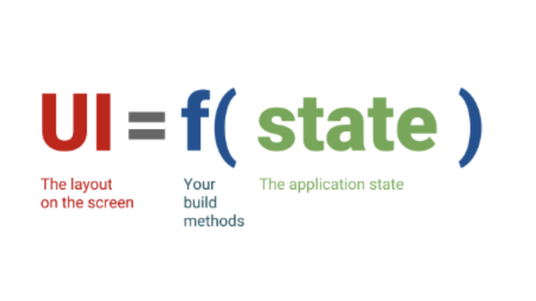
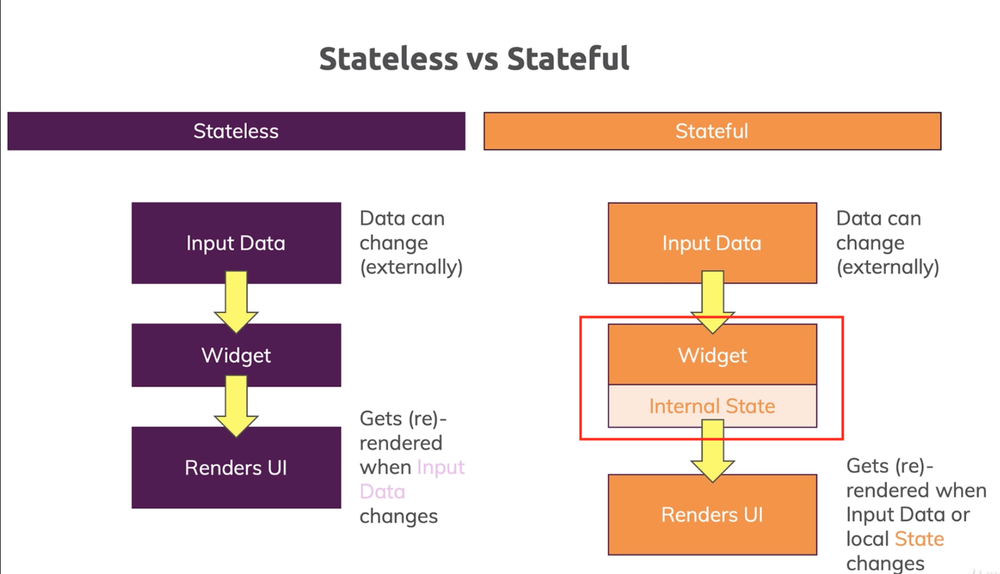
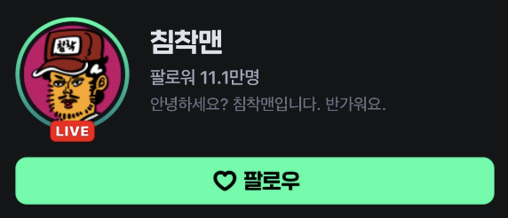
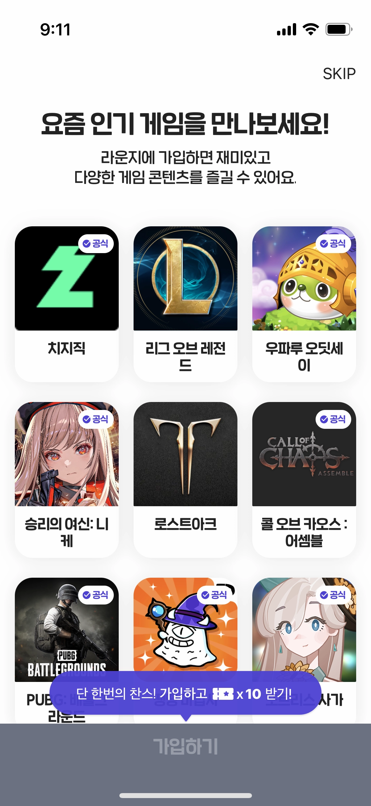
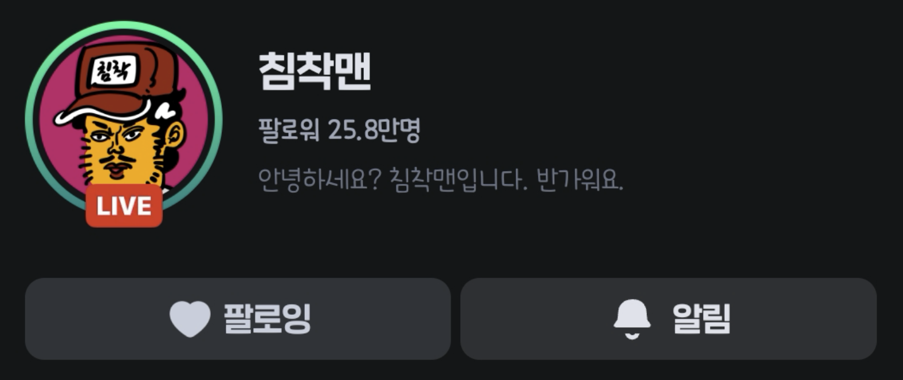

[TOC]


# State?

1. 위젯이 빌드될 때 동기적으로 읽을 수 있는 정보
2. 위젯의 생명주기가 끝나기 전까지 변경될 수 있는 정보

이라고 공식 문서에 쓰여 있습니다.

Flutter는 선언형 UI입니다. 선언형 UI에서의 state입니다.





```dart
@override
Widget build(BuildContext context) {
   return ContentWidget(importantState);
}
```

위젯 = state를 input으로 받아서 

원하는 렌더링을 하는 것

> State에 해당될 수 있는 것?
>
> => 해당 위젯이 표현해야 하는 data


## AppState, Widget State

AppState

앱 전반에 걸쳐 사용되는 data입니다.

- Auth 여부
- User data
- Cache


WidgetState

위젯 내부에서만 사용되는 data입니다.

- widget 내 counter
- toggle button의 isToggled
- 등

Stateless <-> Stateful은 WidgetState를 의미합니다


# Stateless vs Stateful




## StatelessWidget

내부에 state를 가지지 않고, 외부에서 정해진 state로 고정되어있는 위젯입니다.

다시 렌더링 되는 조건

1. 외부에서 주어지는 state가 변경될 때

그 외의 상황에서는 다시 렌더링 되지 않습니다.

예시 코드를 아래 담아보았습니다.

```dart
class TextChip extends StatelessWidget {
  const TextChip({
    super.key,
    required this.text,
    required this.color,
    this.fontSize = 11,
  });

  final String text;
  final Color color;
  final double fontSize;

  @override
  Widget build(BuildContext context) {
    //determine text color
    final textColor =
        color.computeLuminance() > 0.5 ? Colors.black : Colors.white;
    return Container(
      margin: const EdgeInsets.all(2),
      decoration: BoxDecoration(
        color: color,
        borderRadius: BorderRadius.circular(4),
      ),
      padding: const EdgeInsets.only(left: 5, right: 5, top: 2, bottom: 1),
      child: Text(
        text,
        style: TextStyle(
          fontSize: fontSize,
          fontFamily: w500,
          color: textColor,
        ),
      ),
    );
  }
}

```


## 실습1



이 이미지에 해당하는 UI를 작성 해 주세요.

- 이미지는 무작위 이미지로 대체 가능합니다.
- 프로필 사진의 live 뱃지와 초록색 효과는 없이 동그란 이미지로만 만들어 주세요.
- 배경화면의 색은 Color(0xff131517)입니다. (dart에서 색상을 표현할때는 0x + alpha값2byte + 색상코드6byte)로 나타냅니다.
- 바탕화면의 색은 Color(0xff02FFA3) 입니다
- ElevatedButton을 사용하되, style을 줄 때 `ElevatedButton.styleFrom()`을 사용할 수 있습니다.


## StatefulWidget

내부에 state를 가지면서, 외부에서 정해진 state와는 별도로 변동 가능한 위젯입니다.

다시 렌더링 되는 조건

1. 외부에서 주어지는 state가 변경될 때
2. widget의 state가 setState함수를 통해서 ''변경'' 될 때

예시 코드를 아래 담았습니다.

```dart

class HomePointShopDialogButton extends StatefulWidget {
  const HomePointShopDialogButton({super.key, required this.item});

  final Consumeable item;

  @override
  _HomePointShopDialogButtonState createState() =>
      _HomePointShopDialogButtonState();
}

class _HomePointShopDialogButtonState extends State<HomePointShopDialogButton> {
  bool isLoading = false;

  void onPurchase() async {
    if (isLoading) return;
    setState(() {
      isLoading = true;
    });
    await PointController.to.buyComsumeable(widget.item); // process purchase
    if (mounted) {
      setState(() {
        isLoading = false;
      });
    }
  }

  @override
  Widget build(BuildContext context) {
    return ElevatedButton(
      style: elevatedButtonStyle.copyWith(
        backgroundColor: WidgetStateProperty.all(kPrimaryColor),
      ),
      onPressed: onPurchase,
      child: isLoading
          ? Center(
              child: LoadingAnimationWidget.waveDots(
                color: Colors.white,
                size: 18,
              ),
            )
          : Text(
              "${widget.item.price}\$",
              style: h5c(Colors.white),
            ),
    );
  }
}

```


## state의 유무 판단

-> widget 내에 widgetstate 유무를 판단합니다.

1. toggle 버튼

   -> 버튼이 클릭되어 있다는 state가 존재 => stateful

2. 클릭 시 색이 변하는 글자

   -> 마찬가지로 글자가 클릭되어 있다는 state 존재 -> stateful

3. 스톱워치

   -> 시간을 렌더링하기 위한 time ticker data 필요 -> stateful

4. 이미지 위젯

   -> state 필요 없음 -> stateless

5. 상호작용이 없는 상태의 listview의 item

   -> state 필요 없음 & listview에서 data 주입 -> stateless


### 예시로 알아보기



- 인기게임들의 list를 개발한다고 상정할 때
  - listview -> 게임들의 list를 담는 state 필요 -> stateful
  - listview의 item (tile) -> 게임 data는 listview에서 주어짐, 단순 렌더링 -> stateless
  - 보라색 [단 한번의 찬스!...] 버튼 -> 상호작용이 없다는 가정이라면 stateless


## 다시 렌더링 된다는 의미?

-> build 함수가 재 실행됨으로서 위젯이 최신의 state를 가지고 있는 상태로 렌더링 됨니다.

> build 함수에 서버에 api 요청을 하는 로직이 포함되어 있다면 어떻게 될까?

build 코드 안쪽은 가능하면 간결하게 작성하는것이 중요합니다.

```dart
  @override
  Widget build(BuildContext context) {
    // 이 안쪽
    return SomeWidget();
  }
```


## initState

statefulwidget에서 build 전, state가 변경될지라도 한번만 실행되는게 보장되는 코드가 필요합니다.

- 해당 widget 내 late 변수들 초기화
- 시간이 오래 걸리는 operation 시작(지도 로딩, 서버 api call)
- data 전처리 등

```dart
  @override
  void initState() {
    super.initState();
  }

```

#### initState의 필요 예시

- 위젯 A는 서버로부터 카테고리 list를 받아서 렌더링을 한다.
  - 카테고리는 실시간으로 바뀔 필요가 없기 때문에 단 한번만 가져오면 된다.
  - initState를 통해서 한번만 받아온다.
- 페이지 B에 유저가 접근하면 접근 event를 서버에 기록한다.
  - event는 한번만 기록되면 된다.
  - initState를 통해서 page B가 렌더링될때 1번에 한해서 event를 기록한다.


## dispose

statefulwidget이 더이상 사용되지 않아 파괴될 때, dispose메서드가 호출됩니다.

`super.dispose()` 이전에 할당 해 놓은 메모리나 변수, timer ticker, 더이상 필요 없어지는 future함수들 등을 취소하거나 정리해줄 수 있습니다.

```dart
  @override
  void dispose() {
    super.dispose();
  }
```


#### dispose의 필요 예시

- 위젯 A에서 3초뒤에 자기 자신의 state를 업데이트하여 새로 렌더링을 하는 로직이 있다.
  - 해당 로직은 future로 구현 될 것이다.
  - 유저가 3초가 되기 전에 다른 화면으로 넘어가 A가 파괴되었다.
  - setState를 통해 re-render를 요청하면 에러가 발생한다.
  - dispose 콜백에 future를 취소해준다면 해결할 수 있다.
- 위젯 B는 서버로부터 스트리밍 데이터를 받아서 실시간으로 렌더링을 한다.
  - B가 파괴될 때 stream을 끊어주지 않는다면?
  - 유저가 해당 페이지에 다시 들어가게 되면 위젯 B가 서버에 stream연결을 다시 할 것이다.
  - B는 하나지만 서버와의 연결이 여러개가 될 수 있다.


## 실습2



실습 1에서 사용한 코드를 재사용 합니다.

1. 프로필 사진을 클릭할 때 마다 프로필 사진의 state를 변경하여 LIVE뱃지가 보였다가 안보였다가 변경 가능하게 해 주세요.
2. 팔로우 버튼을 클릭하면 위의 사진과 동일하게 버튼의 UI를 변경 해 주세요.
3. 팔로잉 버튼을 클릭하면 다시 원상태로 변경되게 해 주세요.

- Animation 효과는 없어도 됩니다.

> 팔로우 버튼과 알림 버튼이 1:1로 비율로 설정하기 위해선 Row 안에 버튼 각각을 Expanded 위젯을 flex=1로 주고 감싸 주면 됩니다.
>
> Live 뱃지는 프로필 image와 Stack을 통해 겹쳐서 구현 할 수 있습니다.


## Widget 분리

화면을 있는 그대로 구현하다보면 코드는 길어지기 마련입니다.

개인적으로 한 위젯에 150줄이 넘어가지 않게 작성하는 게 좋다고 생각합니다.

코드가 길어지게되거나 분리해야한다고 판단이 되면 다음 과정을 거쳐서 위젯을 분리할 수 있습니다.

1. 위젯에서 분리해야할 부분의 코드를 특정합니다.
2. 적절한 위치에 새로운 dart파일을 적절한 이름으로 생성합니다.
3. state의 유무에 따라서 새로운 statefulwidget이나 statelesswidget을 작성 합니다.
4. 분리한 부분을 원래 코드에서 잘라내어서(ctrl+x) 새로 만든 파일에 붙여넣어줍니다.
5. 잘려나간 부분에 적절한 이름으로 생성한 위젯을 넣어줍니다.

위젯을 분리해야하는 판단은 다음과 같이 합니다.

1. UI상에서 복잡해보이거나 재사용 될 가능성이 있는 위젯을 분리한다.
2. 2번 이상 재사용되는 위젯을 분리한다.
3. 코드가 150줄 이상 길어지면 특정한 기능을 수행하는 위젯으로 분리한다.


## 실습 3


1. [프로필사진], [프로필 이름, 팔로워 수, 설명], [팔로우 버튼] 3개의 위젯으로 분리해서 개발 해 주세요.

2. profile_image.dart`, `profile_info.dart`, `profile_button.dart` 파일명은 다음과 같이 해 주세요.
