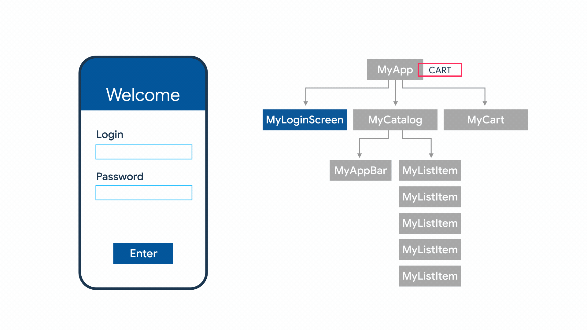
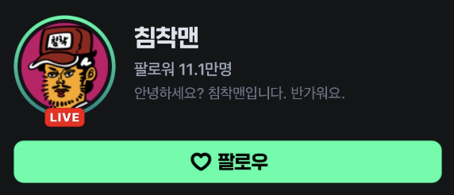

[TOC]


# State management




State를 여러 widget에 걸쳐서 관리해야하는 필요성이 생김. 

`StatefulWidget`의 역할:

- state관리
- re-rendering(값이 바뀌었을 경우)


## How to?

 Flutter에서 기본으로 제공하는 방법과, 상태 관리를 손쉽게 할 수 있도록 해 주는 여러가지 라이브러리 등을 이용해서 구현 가능합니다.

### Value Listenable

- 변수를 `ValueNotifier`로 선언하고

- `ValueListenableBuilder` 위젯을 사용해서 해당 변수가 변할때 다시 렌더링을 시도할 수 있습니다.

  

### Provider

- 상태 관리 패키지 중 하나로, `InheritedWidget`의 기능을 이용한 패키지.

- `ChangeNotifier`를 상속한 클래스를 만들고

- ```dart
  class CountAppProvider extends ChangeNotifier {
  	int count = 0;
    ...
  }
  ```

- `ChangeNotifierProvider`를 이용해서 해당 클래스 의존성을 주입해주고

- ```dart
  ChangeNotifierProvider<CountAppProvider>(
    create: ((context) => CountAppProvider()),
    child: SomeApp(),
  );
  ```

- `Consumer` 위젯을 이용해서 해당 변수가 변할때 다시 렌더링을 시도할 수 있습니다.

- ```dart
  Consumer<CountAppProvider>(builder: (context, value, child) {
  return Scaffold(
    appBar: appBar(title: 'Count:${value}'),
    ),
  );
  ```


### Riverpod

- 상태 관리 패키지 중 하나로, `Provider`의 확장형 같은 느낌?

- `StateProvider`등의 클래스를 이용해서 변수를 만들고

- ```dart
    final StateProvider<int> _count = StateProvider<int>((ref) => 0);
  ```

- Widget 자체를 `ConsumerWidget`을 상속해서 만든 후,

- ```dart
  class CountScreenWithRiverpod extends ConsumerWidget {
  	Widget build(BuildContext context, WidgetRef ref){
      ...
    }
  }
  ```

- `ref.watch(count)` , `ref.read()` 등을 이용해서 해당 변수나 state에 접근


### Bloc

- 상태 관리 패키지 중 하나로, 대형 프로젝트에 가장 적합함(overhead가 크다 but 유지보수와 안정성이 좋음) 

- event와 state를 각각 정의하고, 두개를 bloc이라는 하나의 단위로 묶어서 사용하는 방식

  

### Getx

- 상태 관리 패키지 중 하나로, 가장 쉬운 편

- `GetxController`를 상속해서 컨트롤러를 만들고

- ```dart
  class CounterController extends GetxController {
    final _count = 0.obs;
    int get count => _count.value;
    set count(int value) => _count.value = value;
  }
  ```

- 해당 컨트롤러에 state등을 저장한 후

- `Obx`위젯을 이용해서 다시 렌더링을 시도할 수 있음

- ```dart
  Obx(()=>Text("count: ${Get.find<CounterController>().count}"))
  ```

- 배우기 쉽고 overhead가 적어 작은 프로젝트에 적합

  

## Dependency Injection

DI (Dependency Injection, 의존성 주입) 은 외부에서 의존 객체를 생성하여 넘겨주는 것.

예를들어, A 클래스가 B 클래스를 의존할 때 B 클래스의 인스턴스를 A 가 직접 생성하지 않고 외부에서 생성하여 넘겨주면 의존성을 주입했다고 합니다.

#### 유저가 버튼 클릭 시 서버에서 data를 가져오는 앱이 있다고 가정

1. 버튼 UI => Widget으로 flutter에서 구현 가능
2. 서버에서 Data를 가져오는 logic => 분리해서 클래스를 생성가능.
3. 클래스는 만들었는데, 객체니까 instance화 해서 써야 함.

```dart
class ButtonUI extends StatelessWidget{
  Widget build(context){
    return ElevatedButton(
    	onPressed: () {
        final api = SomeApiClass();
        api.fetchFromServer();
      },
      child:Text("Click!!"),
    );
  }
}

class SomeApiClass{
  Future<void> fetchFromServer() async {
    http.get() ...
    ...
  }
}
```

-> 근데, 기획자의 요청으로 버튼 하나가 추가되어 그 버튼도 서버에서부터 data를 가져오게 만들어야 한다.

-> 서버에서 api를 가져오는 클래스를 재활용하고 싶다.

-> 하위 위젯에서 사용하기 전에, 상위 위젯에서 Dependency Injection을 해 주고,

-> 하위 위젯에서 해당 DI를 통해 주입된 instance를 사용할 수 있게 하면 되지 않을까?

-> 이 방법을 도입하면 State만 UI와 분리되어 개발할 수 있을 뿐만 아니라 logic자체도 분리해서 개발할 수 있지 않을까..?

: Design pattern의 문제


## Getx

해당 패키지를 사용하려면 pubspec.yaml 파일의 dependencies에 해당 줄을 추가해주어야 합니다.

```yaml
name: example
description: "A new Flutter project."
publish_to: "none"
version: 0.1.0

environment:
  sdk: ^3.5.1

dependencies:
  flutter:
    sdk: flutter
  get: ^4.6.6

dev_dependencies:
  flutter_test:
    sdk: flutter
  flutter_lints: ^4.0.0

flutter:
  uses-material-design: true

```


### 사용 예시

#### counter_page.dart

```dart
class CounterPage extends StatefulWidget {
  const CounterPage({Key? key}) : super(key: key);

  @override
  _CounterPageState createState() => _CounterPageState();
}

class _CounterPageState extends State<CounterPage> {
  int counter = 0;

  @override
  Widget build(BuildContext context) {
    return Scaffold(
      floatingActionButton: FloatingActionButton(
        onPressed: () {
          setState(() {
            counter++;
          });
        },
        child: Icon(Icons.add),
      ),
      body: Center(
        child: Text("Counter Page $counter"),
      ),
    );
  }
}

```

위의 코드를 getx를 이용해서 다시 써 보겠습니다.


#### counter_controller.dart

```dart
import 'package:get/get.dart';

class CounterController extends GetxController {
  final _counter = 0.obs;
  int get counter => _counter.value;
  set counter(int value) => _counter.value = value;
}

```

#### counter_page.dart

```dart
import 'package:example/app/feature/counter_controller.dart';
import 'package:flutter/material.dart';
import 'package:get/get.dart';

class CounterPage extends StatelessWidget {
  const CounterPage({super.key});

  @override
  Widget build(BuildContext context) {
    final controller = Get.put(CounterController());

    return Scaffold(
      floatingActionButton: FloatingActionButton(
        onPressed: () => controller.counter += 1,
        child: const Icon(Icons.add),
      ),
      body: Center(
        child: Obx(() {
          return Text("Counter Page ${controller.counter}");
        }),
      ),
    );
  }
}
```


### Getx 사용 팁

#### controller에 static + getter

```dart
class CounterController extends GetxController {
  static CounterController get to => Get.find();

  final _counter = 0.obs;
  int get counter => _counter.value;
  set counter(int value) => _counter.value = value;
}

```

- 이렇게 사용 시 CounterController.to으로 바로 접근 가능


#### initState와 dispose 적극 사용

```dart
class CounterPage extends StatefulWidget {
  const CounterPage({Key? key}) : super(key: key);

  @override
  _CounterPageState createState() => _CounterPageState();
}

class _CounterPageState extends State<CounterPage> {
  @override
  void initState() {
    super.initState();
    Get.put(CounterController());
  }

  @override
  void dispose() {
    Get.delete<CounterController>();
    super.dispose();
  }

  @override
  Widget build(BuildContext context) {
    return Scaffold(
      floatingActionButton: FloatingActionButton(
        onPressed: () => CounterController.to.counter += 1,
        child: const Icon(Icons.add),
      ),
      body: Center(
        child: Obx(() {
          return Text("Counter Page ${CounterController.to.counter}");
        }),
      ),
    );
  }
}
```

- dependency를 적절하게 관리 가능
- 위젯이 사용되지 않을 시 자동으로 삭제 가능


#### 디렉토리 관리 팁

```
📦lib
 ┣ 📂app
 ┃ ┗ 📂feature
 ┃ ┃ ┗ 📂counter
 ┃ ┃ ┃ ┗ 📂logic
 ┃ ┃ ┃ ┃ ┣ 📜counter_controller.dart
 ┃ ┃ ┃ ┗ 📜counter_page.dart
 ┣ 📜main.dart
```

- feature > 기능 단위로 폴더를 구분한 후
- controller는 logic폴더 안에 넣고, page는 기능단위 폴더에 바로 넣어서 관리


ex)

```
📦lib
 ┣ 📂app
 ┃ ┣ 📂data
 ┃ ┃ ┣ 📂api
 ┃ ┃ ┃ ┣ 📜dio_api.dart
 ┃ ┃ ┗ 📂service
 ┃ ┃ ┃ ┣ 📜auth_service.dart
 ┃ ┃ ┃ ┣ 📜router_service.dart
 ┃ ┃ ┃ ┗ 📜storage_service.dart
 ┃ ┣ 📂feature
 ┃ ┃ ┣ 📂error
 ┃ ┃ ┃ ┗ 📜error_page.dart
 ┃ ┃ ┗ 📂home
 ┃ ┃ ┃ ┣ 📂logic
 ┃ ┃ ┃ ┃ ┣ 📜home_controller.dart
 ┃ ┃ ┃ ┃ ┗ 📜reels_controller.dart
 ┃ ┃ ┃ ┣ 📂widget
 ┃ ┃ ┃ ┃ ┗ 📜home_series_player.dart
 ┃ ┃ ┃ ┗ 📜home_page.dart
 ┣ 📜firebase_options.dart
 ┣ 📜main.dart
 ┗ 📜service.dart
```


## 실습



1. [프로필사진], [프로필 이름, 팔로워 수, 설명], [팔로우 버튼] 3개의 위젯으로 분리해서 개발 해 주세요.

2. `profile_image.dart`, `profile_info.dart`, `profile_button.dart` 파일명은 다음과 같이 해 주세요.

---

3강의 마지막 실습 코드를 재활용합니다.

GetxController를 상속한 `profile_controller.dart`를 작성하여, 

 statefulwidget이었던 `profile_button.dart`와 `profile_image.dart`를 해당 컨트롤러로 대체 한 후 statelesswidget으로 변경 해 주세요.

- dependency 주입은 `counter_page.dart`에서 해 주세요.


