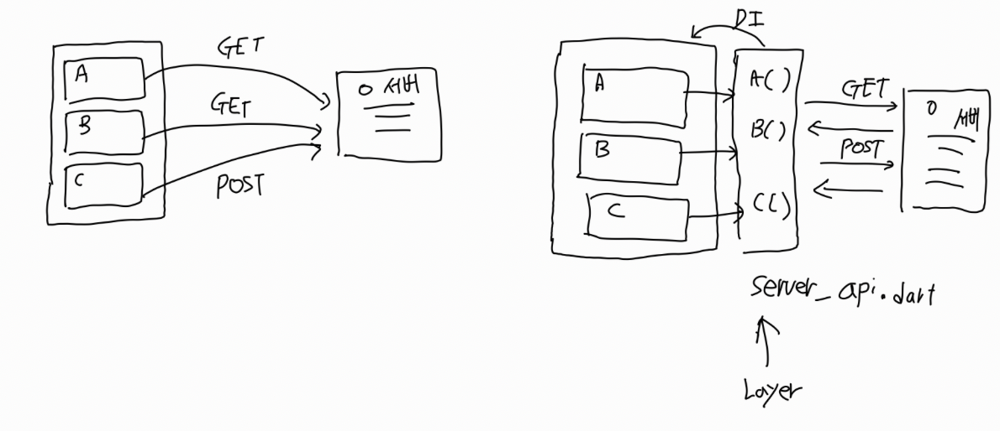
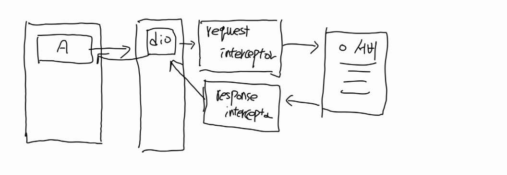
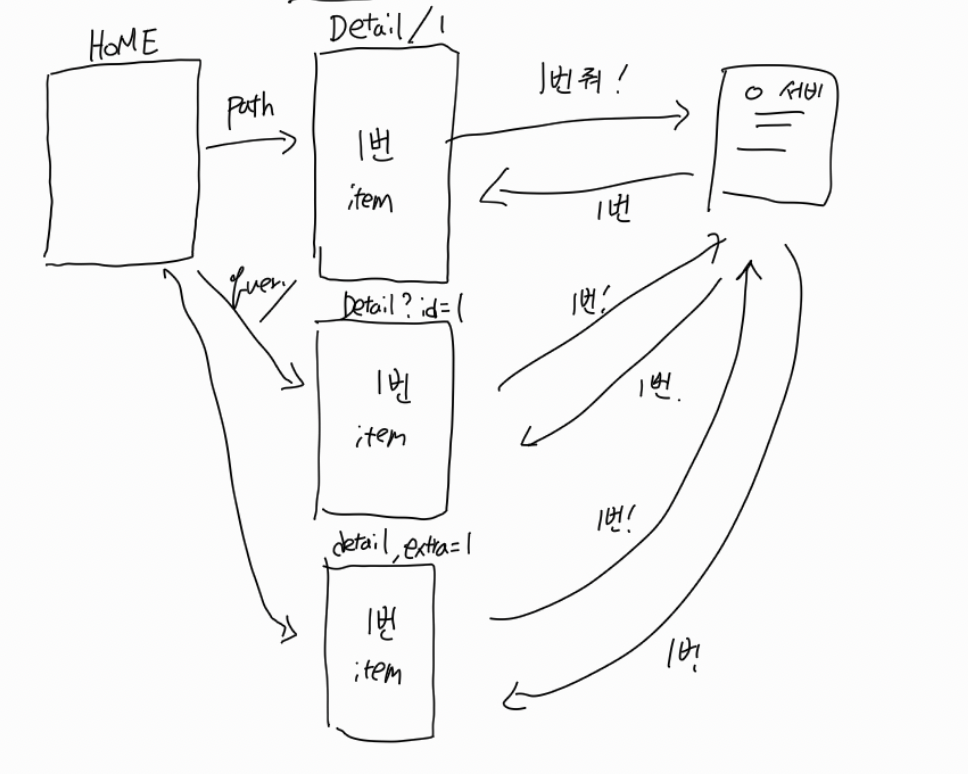

[TOC]


# Networking?


 거의 대부분의 앱은 서버와 data를 주고 받아야 하는 일이 있을겁니다. 

Flutter에서는 어떻게 서버와 data를 주고 받아야 할까요?


## Layering

앱 상에서 서버와 data를 주고받게 될 위젯들은 다양할겁니다.

치지직을 예시로 들어보면,


- 우측 상단의 user 정보
- 광고 banner에 띄울 광고
- 홈에 보여줄 현재 진행중인 방송
- user가 팔로우중인 채널
- ...

이 위젯들은 서로 다른 파일로 다 분리되어있을겁니다.

해당 위젯들에서 직접적으로 서버에 요청을 하도록 코드를 짜면 비슷한 코드가 많이 생길거고, 유지관리면에서 힘든 부분이 많이 생길겁니다.

때문에 layering이 필요합니다.


### Layering?

layering은 프로젝트 아키텍처의 디자인 패턴 문제인데, 여기서는 단순히 서버와 통신하는 부분과 UI를 분리하는 것으로 생각해보겠습니다.

flutter에서는 여러 layer가 있을 수 있고, data를 가지고있는 layer, 서버와 통신하는 layer, ui layer 등등으로 분리할 수 있습니다.

layering이 많아질수록 overhead가 증가하기 때문에 적절한 타협이 필요합니다.


### Layering 하는 법(간단)

저번시간에 다뤘던 개념인 DI(Dependency Injection) 을 사용합니다.

서버와 통신하는 부분을 UI에서 분리 해 내서, 하나의 클래스로 작성한 후

해당 클래스의 인스턴스를 생성해서 context에 injection 해 줍니다.

이후, UI에서는 injection 된 인스턴스에 접근하여 서버와 통신할 수 있습니다.


### Flow



### Implementation

구현은 `http` 패키지를 이용해서 구현합니다.

먼저, 프로젝트의 `pubspec.yaml` 파일에 `http` 패키지를 추가합니다.

```yaml
dependencies:
  flutter:
    sdk: flutter
  http: ^0.13.4
```

http 패키지는 다음과 같이 사용 가능합니다.

```dart
var response = await http.get(Uri.parse('https://example.com/data'));

var response = await http.post(
  Uri.parse('https://example.com/data'),
  headers: {'Content-Type': 'application/json'},
  body: jsonEncode({'key': 'value'}),
);


var response = await http.put(
  Uri.parse('https://example.com/data/1'),
  headers: {'Content-Type': 'application/json'},
  body: jsonEncode({'key': 'updatedValue'}),
);

var response = await http.delete(Uri.parse('https://example.com/data/1'));

```


#### Response 객체

- statusCode

  - 서버의 응답 상태 코드를 나타냅니다.

    예를 들어, `200`은 성공, `404`는 페이지를 찾을 수 없음, `500`은 서버 오류를 의미합니다.

- body

  - 서버의 응답 본문을 `String` 형태로 반환합니다.

    JSON 데이터를 받는 경우, `dart:convert`의 `jsonDecode`를 사용해 Map 형식으로 변환할 수 있습니다.

- headers

  - 응답 헤더 정보를 포함하는 Map입니다. 헤더에는 콘텐츠 타입, 인코딩 방식 등의 정보가 포함되어 있습니다.

- reasonPhrase

  - 상태 코드와 관련된 설명을 나타내며, 성공이나 오류의 간단한 메시지를 제공합니다. 예를 들어, `404` 상태 코드일 경우 "Not Found"라는 문구가 들어갈 수 있습니다.

    

### Code

```dart
// server_api.dart

ㅑmport 'dart:convert';
import 'package:http/http.dart' as http;

class ApiService {
  final String baseUrl = 'https://example.com/api';

  // GET 요청 메서드
  Future<void> fetchData() async {
    final url = Uri.parse('$baseUrl/data');
    try {
      final response = await http.get(url);
      if (response.statusCode == 200) {
        // 서버로부터 받은 데이터 처리
        final data = jsonDecode(response.body);
        print('Data fetched: $data');
      } else {
        print('Failed to fetch data: ${response.statusCode}');
      }
    } catch (e) {
      print('Error occurred: $e');
    }
  }

```


## dio 패키지

`dio` 패키지 또한 `http`패키지와 비슷한 역할을 수행합니다.

`http` 패키지에 비해 더 많은 기능을 제공하는데,  자동으로 요청을 재시도하거나, 요청에 인터셉터를 추가하는 등의 기능이 있습니다.

실제 프로젝트에서는 주로 `dio`패키지를 사용하게 됩니다.


### Implementation

`pubspec.yaml` 파일에 `dio` 패키지를 추가합니다.

```yaml
dependencies:
  dio: ^5.0.0

```


#### GET 요청

```dart
import 'package:dio/dio.dart';

void fetchData() async {
  final dio = Dio();
  try {
    final response = await dio.get('https://example.com/data');
    print(response.data);  // JSON 데이터를 자동 파싱하여 출력
  } catch (e) {
    print('Error occurred: $e');
  }
}
```


### Advanced: Interceptor



`dio`는 interceptor라는 중요하고도 강력한 기능을 제공합니다.

request를 보내기 전, response를 받기 전 interceptor를 통해서 networking을 가능하게 합니다,

request를 보낼 때 auth token을 header에 추가할 수도 있고,

response를 받을 때 401 에러가 나면 token을 refresh하게 할 수도 있습니다.

궁금하시다면 코드를 참고해주시면 되겠습니다.

```dart
import 'package:dio/dio.dart';
import 'package:psychic/app/data/service/auth_service.dart';
import 'package:psychic/app/data/service/storage_service.dart';

class AuthInterceptorWrapper extends InterceptorsWrapper {
  final StorageService storage;
  final AuthService auth;
  final Dio dio;

  AuthInterceptorWrapper(
      {required this.storage, required this.auth, required this.dio});
  @override
  void onRequest(
    RequestOptions options,
    RequestInterceptorHandler handler,
  ) async {
    if (auth.isLoggedIn) {
      options.headers["Authorization"] = "Bearer ${auth.accessToken}";
      return super.onRequest(options, handler);
    }
    super.onRequest(options, handler);
  }

  @override
  void onError(DioException err, ErrorInterceptorHandler handler) async {
    if (err.response?.statusCode != 401) {
      return super.onError(err, handler);
    }

    try {
      await auth.refreshAccessToken();

      err.requestOptions.headers["Authorization"] =
          "Bearer ${auth.accessToken}";

      final res = await dio.fetch(err.requestOptions);

      return handler.resolve(res);
    } catch (error) {
      if (_isTokenError(error)) {
        await auth.handleTokenExpiration();
      }
      if (error is DioException) {
        handler.reject(error);
      }
    }
  }

  bool _isTokenError(Object error) {
    if (error is DioException) {
      return error.response?.statusCode == 401;
    }

    return false;
  }
}

```


## 실습

url: https://jsonplaceholder.typicode.com/todos/1 에서 json을 받아 `jsonDecode` 후 `print`해 보세요.

`dio`패키지를 사용 해 주세요.

```json
{
  "userId": 1,
  "id": 1,
  "title": "delectus aut autem",
  "completed": false
}
```


# Routing

flutter에는 다양한 위젯과 화면이 있는데,

이 화면과 화면을 전환하고, 화면에 접근했다가 다시 이전화면으로 돌아가고 하는 등의 navigation.

화면에 dialog나 alert를 띄워주는 등의 overlay.

앱에 전달 된 링크를 처리하고 적절한 화면으로 전환 해 주며 data를 넘겨주는 deeplink.

크게 세가지의 기능을 통틀어서 routing이라고 합니다.

여기서는 navigation을 주로 보려고 합니다.


## Navigation

flutter에서 기본으로 제공하는 방식입니다.

`BuildContext`로부터 `Navigator`객체에 접근하고, 해당 객체를 통해서 화면을 전환하는 등을 기능을 수행합니다.

이 때 push할 route는 `MaterialPageRoute` 객체로 감싸야 하는데, 이는 `Navigator`가 `Route` Object를 stack으로 관리하기 때문입니다.

화면 전환에 필요한 transition이라던지, 기본적인 기능들을 `Route` object가 가지고 있고, 이 object들을 `Navigator`가 관리한다고 생각하시면 됩니다.


### Code

```dart
 Navigator.of(context).push(
    MaterialPageRoute(
      builder: (context) => const SongScreen(song: song),
    ),
  );
```


### Material App에서의 route 관리

```dart
@override
Widget build(BuildContext context) {
  return MaterialApp(
    routes: {
      '/': (context) => HomeScreen(),
      '/details': (context) => DetailScreen(),
    },
  );
}
```

`MaterialApp`에서 routes 속성에 사전에 가능한 routing들을 정의할 수 있습니다.

key-value 형식으로 넘겨주게 되는데, key값은 routing 할 주소라고 생각하시면 됩니다.

#### 예시

naver.com/ 		=> HomeScreen()

naver.com/cafe	 => CafeScreen()

 이런식으로 링크가 있다면

"/": (context)		 => HomeScreen()

"/cafe" : (context) 	=> CafeScreen()

이 되는 식입니다.


### Limitation

routing 각각을 customize하기가 어려운 부분이 있고,

deeplink 등이 감지되었을때 현재 상태와는 상관 없이 새로운 `Route`를 push해야하는 일이 생깁니다.

때문에 적절하게 처리하기 어려운 부분이 있습니다.


## Router 사용

Flutter에서는 `MaterialApp.router` 또는 `CupertinoApp.router`를 사용하여 앱의 네비게이션을 설정할 수 있습니다. `go_router`와 같은 패키지는 **Router 설정**을 위한 기본 구성을 제공합니다

`Router`에 앱에서 사용할 routing에 대한 정보들과 redirection을 어떻게 처리할 지 등을 다 설정한 후

`MaterialApp.router`를 통해서 router를 손쉽게 설정할 수 있습니다.

### Implementation

`pubspec.yaml` 파일에 `go_router` 패키지를 추가합니다.

```yaml
dependencies:
  go_router: ^13.2.5

```


### Code

```dart
import 'package:flutter/material.dart';
import 'package:go_router/go_router.dart';

void main() {
  runApp(MyApp());
}

class MyApp extends StatelessWidget {
  final GoRouter _router = GoRouter(
		initialLocation: "/",
    routes: [
      GoRoute(
        path: '/',
        builder: (context, state) => HomeScreen(),
      ),
      GoRoute(
        path: '/about',
        builder: (context, state) => AboutScreen(),
      ),
      GoRoute(
        path: '/profile/:id',
        builder: (context, state) {
          final id = state.params['id']!;
          return ProfileScreen(id: id);
        },
      ),
    ],
  );

  @override
  Widget build(BuildContext context) {
    return MaterialApp.router(
      routerConfig: _router,
    );
  }
}

```


### Routing에 parameter 넘기기

특정 page에 넘어간 뒤에 해당 page에서 서버로부터 data를 읽어오는 로직이 있다고 가정해봅시다.



이럴 때에 `pathParameter`, `queryParameter`, `extra` 이 세가지를 이용해서 구현이 가능합니다.

```dart
// path parameter
GoRoute(
  path: 'content_category/:category',
  builder: (context, state) {
    final category = state.pathParameters['category'];
    if (category == null) {
      return const ErrorPage();
    }
    return ContentCategoryPage(category: category);
  },
);

// 이렇게 사용
context.push('/content_category/${CATEGORY}')

//##################################################
  
// query parameter
GoRoute(
  path: "/image",
  builder: (context, state) {
    final cursor = int.tryParse(
      state.uri.queryParameters['cursor'] ?? "",
    );
    return ImagePage(
      cursor: cursor,
    );
  },
);

//이렇게 사용
context.push("/image?cursor=${CURSOR}")
  
//##################################################
  

// extra
GoRoute(
  path: "qa",
  builder: (context, state) {
    final session = state.extra as ShareSession;

    return QaPage(session: session);
  },
),

// 이렇게 사용
context.push("/qa", extra:ShareSession())
```


### Advanced: Redirect로 Auth구현

 유저가 로그인하지 않은 상태라면 home 화면 등에 접근하지 못하게 하면서, login화면이나 onboard화면으로 가도록 만들고 싶을 때가 있습니다.

 사실 이런 경우가 로그인이 필요한 앱이라면 굉장히 빈번한 일입니다. 로그인을 해야 유저 정보를 받아올 수 있고, 유저 정보를 편집하는 페이지 등은 로그인이 없으면 오류가 나게 되기 때문이죠. 

 때문에 유저가 특정 routing에 접근하려고 할 때, 접근 불가하게 하고 로그인화면등으로 redirection 하는 코드가 필요합니다.

`GoRouter`에서 redirect를 이용하면 가능합니다.


```dart
 final GoRouter _router = GoRouter(
	initialLocation: "/",
   redirect: (context, state) {
      final path = state.uri.toString();
      final isOnboard = path.startsWith("/onboard");
      if (!isOnboard) {
        if (AuthService.to.isLoggedIn) {
          return null;
        }
        return "/onboard";
      }
      return null;
    },
    routes: [
      GoRoute(
        path: '/',
        builder: (context, state) => HomeScreen(),
      ),
      GoRoute(
        path: '/onboard',
        builder: (context, state) => OnboardScreen(),
      ),
    ],
  );

```


## 실습

`GoRouter`를 이용해서 `HomeScreen`, `DetailScreen` 2가지를 구성 해 주세요.

#### HomeScreen

화면 가운데에 버튼을 두어서 버튼을 누르면 `DetailScreen`으로 이동 해 주세요.

이 때, `DetailScreen`에 10 이라는 값을 전달 해 주세요.

#### DetailScreen

화면 가운데에 `Text`를 두고 `HomeScreen`에서 전달한 값을 보여주세요.
