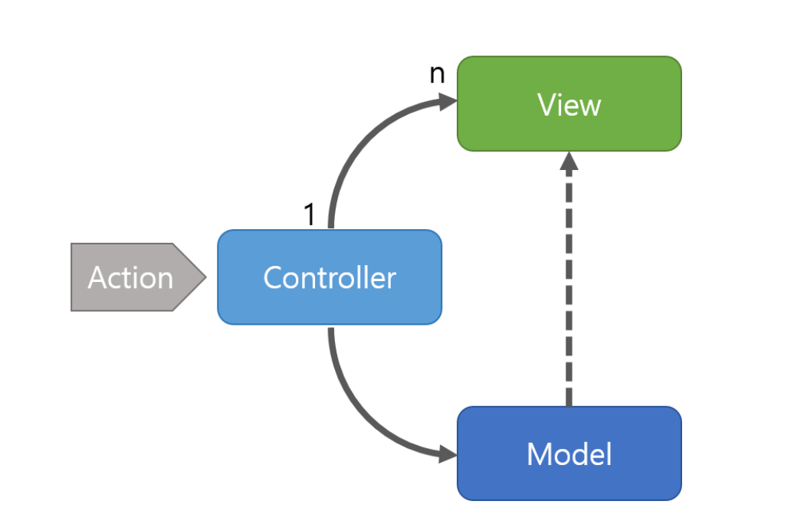
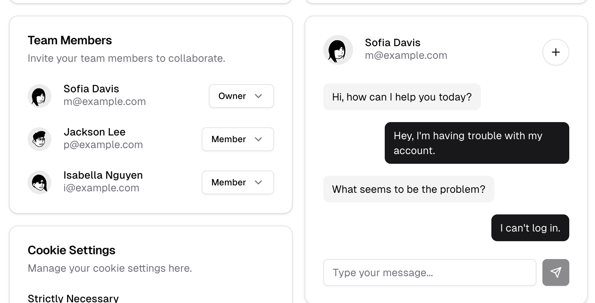
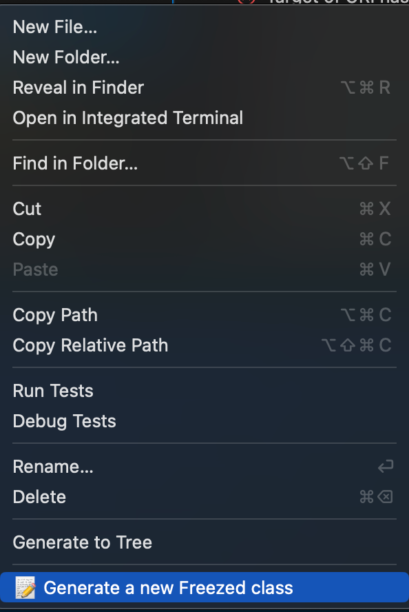
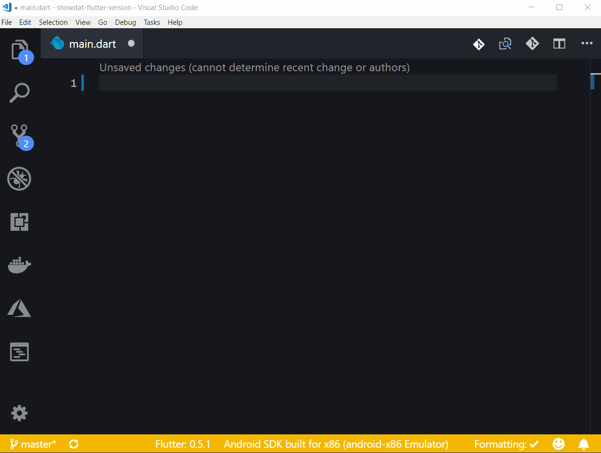

[TOC]


# Flutter 개발을 위한 노하우

이번 강의가 flutter 강의의 마지막인데요, 마지막인만큼 flutter를 실제로 개발한다고 했을 때 어떻게 개발해야 빠르고, 효율적으로 개발할 수 있을지 간단하게 소개해보려고 합니다.

## 디자인 패턴



기본적으로 MVC 패턴을 사용하고 있습니다.

UI랑 logic이랑 분리해서 개발하는게 유지보수에 유용하다고 생각하고 있기 때문입니다.

이 때 분리한 `Controller`는 다른 `View`에도 의존성 주입을 통해 사용할 수 있습니다.

특히, 앞선 강의에서 설명했던 `getx`와 특히 더 잘 어울리는 패턴이라고 생각합니다.


## 패키지 - UI편

### shimmer

https://pub.dev/packages/shimmer 

서버로부터 로딩이 다 되기 전에 로딩중이라는 효과를 보여주는 애니메이션 패키지 입니다.


기존에 그려지는 부분(Container로 색을 주거나 text 등 Padding이 아닌 렌더링이 있는부분)이 원하는 색으로 반짝이게 구현할 수 있습니다.

```dart
SizedBox(
  width: 200.0,
  height: 100.0,
  child: Shimmer.fromColors(
    baseColor: Colors.red,
    highlightColor: Colors.yellow,
    child: Text(
      'Shimmer',
      textAlign: TextAlign.center,
      style: TextStyle(
        fontSize: 40.0,
        fontWeight:
        FontWeight.bold,
      ),
    ),
  ),
);

```


### flutter_staggered_animations 

https://pub.dev/packages/flutter_staggered_animations

로딩이 끝난 후, `ListView`의 item들이 렌더링이 될 텐데요, 한번에 확 나와버리면 아무래도 이상한 느낌이 있습니다.

매끄럽지 못한 경험을 겪을 수 있기 때문에 FadeIn을 통해서 많이들 구현하는데, 좀 더 미려한 효과를 주고 싶을 때 해당 패키지를 사용합니다.


`AnimationLimiter` 로 listview를 감싸고, item을 `AnimationConfiguration.staggered~` 로 감싼 후 원하는 효과로 감싸주면 효과를 간편하게 구현할 수 있습니다.

```dart
AnimationLimiter(
  child: ListView.builder(
    itemCount: 100,
    itemBuilder: (BuildContext context, int index) {
      return AnimationConfiguration.staggeredList(
        position: index,
        duration: const Duration(milliseconds: 375),
        child: SlideAnimation(
          verticalOffset: 50.0,
          child: FadeInAnimation(
            child: YourListChild(),
          ),
        ),
      );
    },
  ),
);
```


### auto_size_text

https://pub.dev/packages/auto_size_text


width Constraint가 확실하게 정해져있을 때, text는 자동으로 줄내림하여 렌더링됩니다.

이때 특정 줄 수(ex. 2줄)을 유지하고 싶은 경우에 자동으로 글자 크기를 줄여줄 수 있는 패키지입니다.

```dart
AutoSizeText(
  'A really long String',
  style: TextStyle(fontSize: 30),
  minFontSize: 18,
  maxLines: 4,
  overflow: TextOverflow.ellipsis,
)
```


### carousel_slider

https://pub.dev/packages/carousel_slider


좌 우로 갤러리처럼 보이고 이를 scroll하게 만들 수 있는 패키지입니다.

PageView로도 가능한데, 이를 좀 더 쉽게 이미지 전용으로 만들어서 쓸 수 있는 느낌입니다.

꽤나 애용하는 패키지입니다.

```dart
CarouselSlider(
  options: CarouselOptions(height: 400.0),
  items: [1,2,3,4,5].map((i) {
    return Builder(
      builder: (BuildContext context) {
        return Container(
          width: MediaQuery.of(context).size.width,
          margin: EdgeInsets.symmetric(horizontal: 5.0),
          decoration: BoxDecoration(
            color: Colors.amber
          ),
          child: Text('text $i', style: TextStyle(fontSize: 16.0),)
        );
      },
    );
  }).toList(),
)
```


### Shadcn_ui

https://flutter-shadcn-ui.mariuti.com/

https://pub.dev/packages/shadcn_ui



최근에 즐겨쓰고 있는 디자인 시스템 ui 패키지입니다.

Material디자인이나 Cupertino를 쓰기 싫어하는 개발자들을 위해서 예쁜 UI를 제공합니다.


## 패키지  - Util편

### intl

https://pub.dev/packages/intl

요약: 사용하는 언어에 맞게 date/number formatting, message translation, bidrectional text를 제공 해 주는 유용한 패키지

종종 숫자를 formatting 해야 할 때가 있습니다.

예를 들어 10000000이라는 숫자를 생각 해 보겠습니다.

1000만인데, 이 숫자는 10,000,000으로 써야 가독성이 좋습니다.

또는 이 숫자가 돈을 나타낸다고 할 때 10,000,000원 이라고 쓰여야 유저 입장에서 편하게 읽을 수 있을 것 입니다.

```dart
NumberFormat("###,###,###,###,###원").format([number])
```

이 코드 한줄로 format이 가능합니다.


어떨 땐 어플리케이션이 한국만을 타겟하는 게 아닐 때도 있습니다.

그럴 땐 '원'이 아니라 'usd' 혹은 'VND' 등 이 될 수도 있는데, 이럴 때 손쉽게 localization을 할 수 있는 기능을 제공 해 줍니다.

```dart
initializeDateFormatting('ko_KR', null).then(
  (_) async => runApp(
    ...
  ),
)
```


숫자 뿐만이 아니라 날짜도 마찬가지입니다.

dart에서 제공하는 강력한 클래스 DateTime이 있지만 이를 적재적소에 맞게 formatting 하는 건 다른 일입니다.

2023-11-24라는 날짜가 있다면, 이 날짜를 2023년 11월 24일로, 혹은 20231124, 2023/11/24 등 여러가지 포멧으로 표현 가능합니다.

```dart
DateFormat('yyyy년 M월 d일').format([datetime]);
DateFormat('yyyyMd').format([datetime]);
DateFormat('yyyy/M/d').format([datetime]);
```

모든 프로젝트에서 유용하게 사용할 수 있는 패키지입니다. 앱을 개발한다고 할 때 깔고 시작해도 좋습니다.


### permission_handler

https://pub.dev/packages/permission_handler

android, ios를 개발 할 때에 permission이 필요한 기능들이 몇 있습니다.

제일 유명한 예시로 image picker를 사용할 때입니다.

이때 permission handler를 사용하면 permission의 상태와 함께 승인을 요청할 수 있습니다.

제 경우에는 permission이 필요한 기능 직전에 다음 함수를 호출해서 사용하고있습니다.

```dart
Future<bool> _checkPermission(Permission permission, String label) async {
  final status = await permission.status;
  switch (status) {
    case PermissionStatus.granted:
    case PermissionStatus.limited:
      return true;
    case PermissionStatus.denied:
      final result = await permission.request();
      if (result.isGranted) return true;
      SimpleNotify().show("Permission needed to this function work.");
      return false;
    case PermissionStatus.permanentlyDenied:
      openAppSettings();
      return false;
    default:
      return false;
  }
}
```

물론 이외에도 native한 설정이 필요하므로 패키지 페이지에서 참고해서 설정해주어야 합니다.


### freezed + build_runner

https://pub.dev/packages/freezed

https://pub.dev/packages/freezed_annotation

https://pub.dev/packages/json_serializable

https://pub.dev/packages/build_runner

data class들을 생성할 때 가장 유용하게 쓰고있는 패키지입니다.

vscode 사용 시 `Freezed` extension과 함께 사용하면 바로 폴더에서 우클릭 후 freezed클래스를 생성하기 위한 기본 파일을 생성해주기 때문에 사용하는것을 추천합니다.

`build_runner` 와`freezed_annotation`는 필수로 사용해야하고,  `json_serializable`을 이용하면 toJson, fromJson도 동시에 구현 할 수 있습니다.

- define a constructor + properties
- override `toString`, `operator ==`, `hashCode`
- implement a `copyWith` method to clone the object
- handle (de)serialization

기본적으로 이와 같은 기능을 구현해주기 때문에, immutable한 객체를 만드는게 훨씬 쉬워집니다.

```dart

import 'package:freezed_annotation/freezed_annotation.dart';

part 'example.freezed.dart';
part 'example.g.dart';

@freezed
class Example with _$Example {
  factory Example({
    required int id,
    required String data,
  }) = _Example;
	
  factory Example.fromJson(Map<String, dynamic> json) =>
			_$ExampleFromJson(json);
}

```

예시 example.dart 파일입니다. vscode 플러그인을 이용하면 위와 같은 코드를 만들어주는데요,



저렇게 factory constructor 안쪽만 채워준 후에(예시에서는 id, data) build_runner로 빌드를 하면 .g.dart파일과 .freezed.dart파일이 자동으로 생성됩니다.

이 `Example`이라는 클래스는 immutable하면서 `copyWith`, `toJson`, `fromJson`, `==` 등이 자동으로 구현되게 됩니다.

> build_runner로 빌드하기 위해선 프로젝트의 루트 디렉토리에서
>
> ```shell
> dart run build_runner build
> ```
>
> 를 입력해주면 됩니다.


## plugin 편

### Flutter Widget Snippets
 https://marketplace.visualstudio.com/items?itemName=alexisvt.flutter-snippets



유용한 snippet들을 제공합니다.

flutter의 특성상 여러개의 위젯 파일을 개발할 수 밖에 없는데, 주로 사용하는 import라던가 statelesswidget, statefulwidget등의 구조를 빠르게 짤 수 있습니다. 

주로 사용하는것은 fimmat, fstful, fstless인데 추가로 더 외워서 사용하면 확실히 개발속도가 빨라짐을 체감할 수 있습니다.

###  Build Runner

https://marketplace.visualstudio.com/items?itemName=GaetSchwartz.build-runner

- Launch `build_runner build` with `CTRL+SHIFT+B` (`CMD+SHIFT+B` on Mac).
- Launch `build_runner build` with `--build-filter` by using `CTRL+ALT+B` (`CMD+ALT+B` on Mac) to only rebuild the selected file. Way faster than the regular build. 

원래 `dart run build_runner build`를 터미널에서 실행해야 했다면 단축키로 빌드가 가능해집니다. 


### Freezed
 https://marketplace.visualstudio.com/items?itemName=blaxou.freezed

파일 디렉토리에 우클릭 후 플러그인을 사용할 수 있습니다.


# Firebase

거의 대부분의 상황에서 push알림을 구현할 때, firestore연결, google login 연동, google analytics 연동, crashlytics 사용 등...

deploy를 목적으로 하고 있으면서, 써드파티 앱을 사용 할 만큼 규모가 크지 않은 서비스에서는 거의 대부분 firebase를 연동 해야 할 겁니다.

flutter에선 flutterfire라는 cli를 툴을 이용해서 30초 안에 프로젝트에 firebase를 연동할 수 있습니다.

## Flutterfire

2가지의 선행 요구 사항이 있습니다.

> 1. firebase CLI설치
> 2. dart PATH 설정

1번은 다음 링크를 참고해서 설치합니다. https://firebase.google.com/docs/cli?hl=ko#setup_update_cli

2번은 dart의 path를 설정 해 주어야 하는데, 대부분의 경우 다음의 경로에 위치합니다.

`/{FLUTTER SDK 설치위치}/bin/cache/dart_sdk `

운영체제에 맞게 PATH설정을 해 주면 됩니다.

이후 

```shell
firebase login
dart pub global activate flutterfire_cli
cd {프로젝트의 root 디렉토리}
flutterfire configure
```

를 입력하여 firebase를 설정 완료하면 됩니다.


## Core

https://pub.dev/packages/firebase_core

firebase에서 제공하는 여러가지 기능을 이용하기 위해선 위의 패키지를 먼저 추가 해 주어야 합니다.

이후 main문안에서 다음 명령어를 통해서 initialize를 해 주어야 오류가 생기지 않습니다.

```dart
await Firebase.initializeApp(
  options: DefaultFirebaseOptions.currentPlatform,
);
```


## Analytics

https://pub.dev/packages/firebase_analytics

사용자가 앱을 어떻게 사용하고 있는지 트래킹 할 수 있는 기능을 제공합니다.


## Crashlytics

https://pub.dev/packages/firebase_crashlytics

앱이 오류가 나거나 강제종료가 나는 등 annomaly가 발생하면 서버로 stacktrace와 오류 메시지를 보내줍니다.

firebase console에서 이를 확인할 수 있는데, 아무리 충분히 test를 많이 했어도 client의 상태에 따라서 다양한 오류가 생길 수 있으니 항상 채크 해 주는 게 좋습니다.


# 분류에 담지 못한 팁

## ensureInitialized()

```dart
void main(){
	WidgetsFlutterBinding.ensureInitialized();
  SystemChrome.setPreferredOrientations(
  	[DeviceOrientation.portraitUp],
  );
  runApp()
}

```

`runApp` 전 `WidgetsFlutterBinding.ensureInitialized();` 실행 해 주기. 

생길 수 있는 버그를 수정해줍니다.

## runZonedGuarded

내부에서 혹시 에러가 생겨도 catch 해 줍니다.

```dart
  runZonedGuarded<Future<void>>(
    () async {     
      runApp(
        ShadApp.router(
        ),
      );
    },
    (error, stackTrace) {
      log('runZonedGuarded: ', error: error, stackTrace: stackTrace);
      debugPrint('runZonedGuarded: $error');
      if (kReleaseMode) {
        FirebaseCrashlytics.instance.recordError(error, stackTrace);
      }
    },
  );
```

해당 코드는 runApp을 zone안에 넣어서 앱에서 혹시 crash가 발생해도 강제종료되는 일은 막아줄 수 있는 코드입니다.


## trouble shooting

앱을 잘못짜서 생기는 문제보다 개발환경을 변경하거나 새로 만들었을 때, 패키지간 충돌이 생겼을 때, 잘 작동하지 않는 오픈소스 패키지를 추가해서 오류가 생길 때.

이럴 때 디버깅하고 수정하는 시간이 훨씬 오래 걸린다. 패키지를 사용한다면 너무 오래되지 않는 패키지를 사용하는것을 추천하고, mac의 경우 xcode 업데이트는 업데이트 하기 전 최소 20번 고민하고 업데이트를 하는 것 추천합니다.

내가 만들지 않는 패키지의 경우 패키지의 github에 올라와있는 issue 탭을 확인하는것도 좋은 방법이다.


