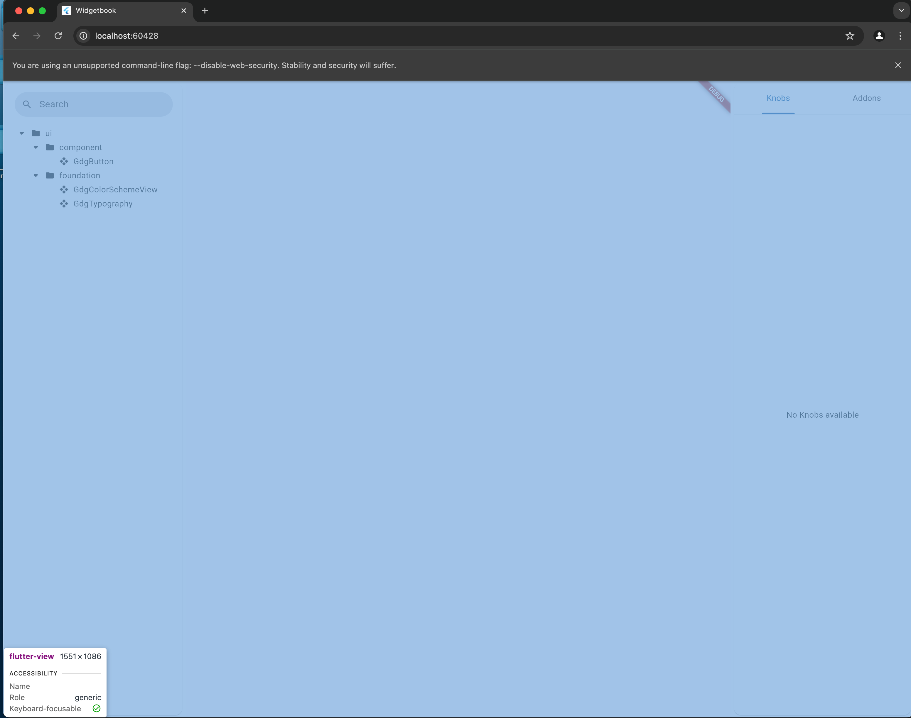
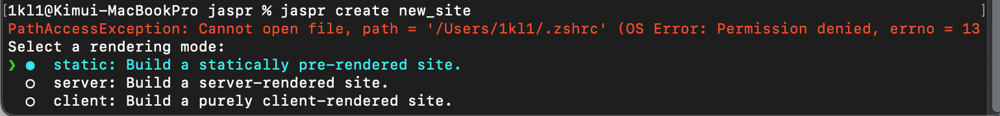
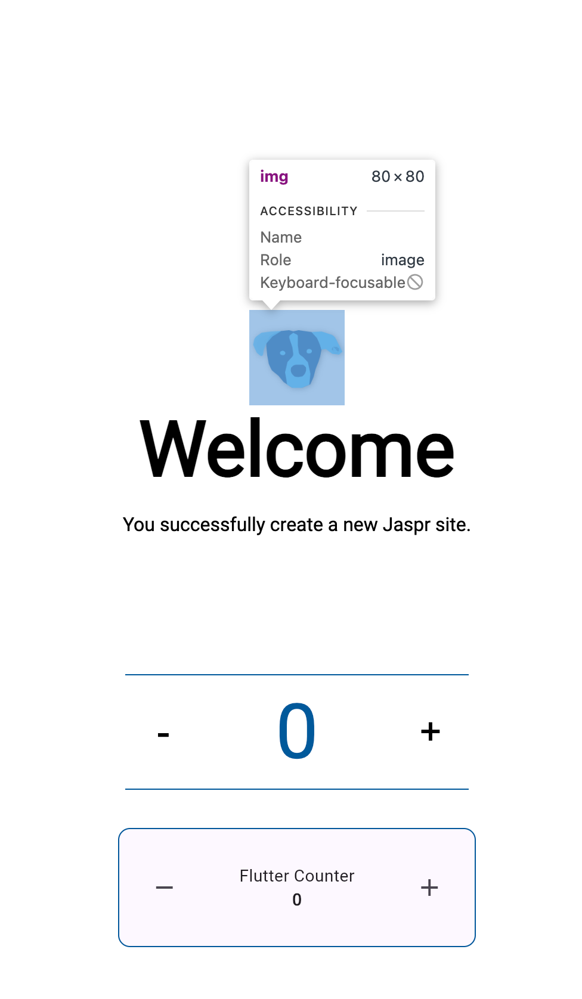
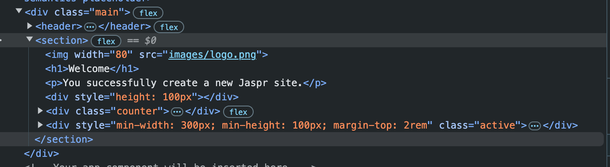

## Flutter web

Flutter는 android, ios, web, linux, windows, macos까지 다양한 기기에서 사용 가능하게 빌드가 가능합니다.

그 중에서도 Flutter는 주로 android와 ios 크로스플랫폼 개발에서 많이 쓰이곤 합니다.

web도 굉장히 유용할 것 같은데, 왜 아직까지 Flutter로 web을 만든 사이트를 한번도 보지 못했을까요..?

그 이유는.. flutter web이 **CanvasKit**으로 렌더링하기 때문입니다.

화면 전체가 전체가 하나의 element로 잡힙니다.. 보이는 택스트를 드래그하는것 조차 불가능합니다.

여러가지 문제가 있는데,

#### 초기 flutter 렌더링 번들을 가져올때까지 로딩이 길다

 canvas렌더링을 위해 수많은 javascript파일이 필요한데, 모두가 로딩이되어 첫 화면이 렌더링이 될 때 까지 로딩이 무척 깁니다.

#### SEO가 사실상 불가능하다

검색엔진 크롤러는 html로부터 시멘틱 태그, meta태그 등 여러가지를 고려하여 컨텐츠를 색인하는데, 기본적으로 Server Side Renderiong이 지원되지 않고 Client Side Rendering이며, Canvas에 렌더링된 텍스트는 HTML 구조로 노출되지 않기 때문에 검색 엔진이 내용을 색인할 수 없습니다. 

#### 브라우저 호환성이 떨어진다

기본적으로 웹사이트를 사용할 떄 예측하는 기능들이 지원되지 않습니다. 또한 Chrominum기반 브라우저가 아닌 브라우저에서 작동이 제대로 보장되지 않습니다.

#### URL과 라우팅문제

Flutter Web은 SPA 방식으로 동작하기 때문에, 페이지가 전환되더라도 브라우저의 URL은 자바스크립트를 통해 변경됩니다. 검색 엔진이 이 동적 URL 구조를 이해하지 못할 가능성이 있습니다.


그래서 Flutter web은 보통 사용하지 않습니다.

하지만 자기가 사용하는 언어를 좋아하고 그 언어로 할 수 있는 것이 많아지길 원하는 사람은 어디든지 있죠.


# Jaspr

 **Jaspr**이라는 새로운 Dart 기반 웹 프레임워크를 최근에 알게 되어 소개하고자 합니다.

## SSR 지원

우선, Jaspr는 Dart로 작성된 웹 프레임워크로, 클라이언트 사이드와 서버 사이드 렌더링(SSR)을 모두 지원합니다.



`jaspr_cli`를 이용해서 생성, 빌드, 배포 등이 가능한데 이런 옵션을 선택할 수 있습니다.

|                                               | **static**                                                   | **server**                                                   | **client** |
| --------------------------------------------- | ------------------------------------------------------------ | ------------------------------------------------------------ | ---------- |
| **Pre-Rendering**                             | Yes (at build time)                                          | Yes (at request time)                                        | No         |
| **Client-side rendering** / **Interactivity** | Yes (with [Hydration](https://docs.page/schultek/jaspr/get_started/hydration)) | Yes (with [Hydration](https://docs.page/schultek/jaspr/get_started/hydration)) | Yes        |
| **Needs Server**                              | No                                                           | Yes                                                          | No         |
| **Deploy to any Webhoster**                   | Yes                                                          | No                                                           | Yes        |
| **Custom backend**                            | No                                                           | [Yes](https://docs.page/schultek/jaspr/going_further/backend) | No         |

이런 옵션을 제공하는데, 여기서 Hydration이란, interactive한 초기 html 사이트를 사전에 빌드하는 옵션입니다.

### Hydration의 작동 방식

#### **1. Pre-Rendering**

- 서버 또는 정적 모드에서, 앱은 HTML로 렌더링되어 브라우저에 전송됩니다.
- 이 초기 렌더링은 매우 빠르게 "첫 번째 콘텐츠 페인트(First Contentful Paint)"를 제공합니다.
- 하지만 이 시점에서는 버튼 클릭과 같은 인터랙티브한 기능은 작동하지 않습니다.

#### **2. Hydration**

- 브라우저가 사이트와 관련된 추가 파일(JavaScript, 이미지 등)을 로드한 후, 클라이언트에서 애플리케이션을 실행합니다.
- 클라이언트는 서버에서 렌더링된 HTML을 "이어받아(pick up)" 렌더링을 재개합니다. 이 과정을 Hydration이라고 합니다.
- Hydration이 완료되면 버튼 클릭 등 모든 인터랙션이 활성화됩니다.
- 

### Jaspr에서 Hydration 설정

#### **자동 Hydration (추천)**

- 컴포넌트에 `@client` 어노테이션을 추가하면 해당 컴포넌트가 자동으로 Hydration됩니다.
- 서버에서 사전 렌더링된 HTML을 클라이언트에서 이어받아 렌더링을 재개합니다.

```dart

@client
class MyComponent extends StatelessComponent {
  @override
  Iterable<Component> build(BuildContext context) sync* {
    yield Text('This is interactive!');
  }
}
```


## 렌더링

Jaspr는 Flutter와 일면 비슷하지만 **HTML/CSS로 렌더링**되는 Vue.js나 React와 같은 웹 프레임워크처럼 동작합니다. 

 StatelessComponent와 StatefulComponent의 `build()` 메서드가 **Iterable<Component>**를 반환하도록 설계되었다고 합니다. HTML 구조가 여러 자식 요소를 가질 수 있다는 점을 반영했습니다.




## 하이브리드

Jaspr는 **Flutter Web 앱을 Jaspr 웹사이트에 임베딩**하는 기능을 지원합니다. 이를 통해 SEO와 빠른 로딩 속도가 중요한 메인 웹사이트에 Jaspr를 사용하고, 특정 페이지에서 Flutter Web 앱을 임베딩해 복잡한 UI와 기능을 제공할 수 있습니다.


## 단점

**프리빌트 컴포넌트 부족**: Material, Cupertino와 같은 Flutter의 UI 라이브러리가 없습니다. 대신 CSS 프레임워크를 활용해야 합니다.

**텍스트 스타일링 제한**: 텍스트 요소에 스타일을 직접 지정하는 대신 CSS 속성을 사용해야 합니다.


## 직접 해보자!

static/server mode, client mode가 프로젝트 구성 구조가 다르지만, 한번 client mode로 개발 해 보았습니다.

먼저 app에서 route를 선언 해 줍니다.

```dart
import 'package:jaspr/jaspr.dart';
import 'package:jaspr_router/jaspr_router.dart';

import 'components/header.dart';
import 'pages/about.dart';
import 'pages/home.dart';

// The main component of your application.
class App extends StatelessComponent {
  const App({super.key});

  @override
  Iterable<Component> build(BuildContext context) sync* {
    yield div(classes: 'main', [
      Router(routes: [
        ShellRoute(
          builder: (context, state, child) => Fragment(children: [
            const Header(),
            child,
          ]),
          routes: [
            Route(
              path: '/',
              title: 'Home',
              builder: (context, state) => const Home(),
            ),
            Route(
              path: '/about',
              title: 'About',
              builder: (context, state) => const About(),
            ),
          ],
        ),
      ]),
    ]);
  }
}

```

이렇게 App Compnent를 선언 해 주면 header와 route content를 가진 화면 이 됩니다?!



여기서 Route에 해당하는 페이지는 html같이 component를 만들어줍니다.

```dart
import 'package:jaspr/jaspr.dart';

class About extends StatelessComponent {
  const About({super.key});

  @override
  Iterable<Component> build(BuildContext context) sync* {
    yield section([
      ol([
        li([
          h3([text('📖 Documentation')]),
          text('Jaspr\'s '),
          a(href: 'https://docs.page/schultek/jaspr', [text('official documentation')]),
          text(' provides you with all information you need to get started.'),
        ]),
        li([
          h3([text('💬 Community')]),
          text('Got stuck? Ask your question on the official '),
          a(href: 'https://docs.page/schultek/jaspr', [text('Discord server')]),
          text(' for the Jaspr community.'),
        ]),
        li([
          h3([text('📦 Ecosystem')]),
          text(
              'Get official packages and integrations for your project like jaspr_router, jaspr_tailwind or jaspr_riverpod. Find packages built for Jaspr on pub.dev using the '),
          a(href: 'https://pub.dev/packages?q=topic%3Ajaspr', [text('#jaspr')]),
          text(' topic, or publish your own.'),
        ]),
        li([
          h3([text('💙 Support Jaspr')]),
          text('If you like Jaspr, consider starring us on '),
          a(href: 'https://github.com/schultek/jaspr', [text('Github')]),
          text(' and tell your friends.'),
        ]),
      ]),
    ]);
  }
}

```


이렇게 내용물을 만들어줬으니, header도 어떻게 구성되는지 알아봅시다.

```dart
import 'package:jaspr/jaspr.dart';
import 'package:jaspr_router/jaspr_router.dart';


class Header extends StatelessComponent {
  const Header({super.key});

  @override
  Iterable<Component> build(BuildContext context) sync* {
    var activePath = RouteState.of(context).location;

    yield header([
      nav([
        for (var route in [
          (label: 'Home', path: '/'),
          (label: 'About', path: '/about'),
        ])
          div(classes: activePath == route.path ? 'active' : null, [
            Link(to: route.path, child: text(route.label)),
          ]),
      ]),
    ]);
  }
}

```

BuildContext를 이용해서 label을 빌드 해 주고 있는점을 볼 수 있었습니다.

이제까지 개발했던 flutter와는 무척 다른느낌인 것을 알 수 있었습니다..

## run

```shell
cd {PROJECT_DIRECTORY}
jaspr serve
```

해당 명령어를 통해서 개발한 사이트를 볼 수 있습니다.

dart의 특징인 hot reload도 매우 잘 작동하는것을 확인 할 수 있었습니다.


## 후기

flutter의 Material Design이나 스타일 체계를 사용하지 못하는게 생각보다 큰 단점이었습니다.

flutter와는 많이 달라서 러닝커브가 있습니다.

web 개발에 대한 지식도 어느정도 필요하여 둘 다 알아야 제대로 개발할 수 있을 것 같습니다.