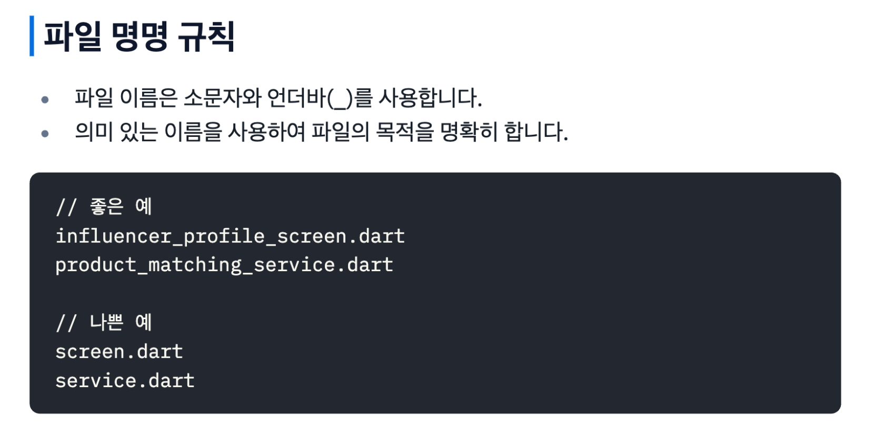

# Practical Flutter 템플릿

최근에 GDGoC(Google Developer Student Clubs)에서 구글 솔루션 챌린지에 참여하는 주니어/멤버들을 위해 Flutter 템플릿을 만들었습니다.

구글 솔루션 챌린지는 2달이라 시간 안에 사회적 문제를 해결하는 서비스을 개발해야 하는 대회인데,

매번 새 프로젝트를 시작할 때마다 같은 설정을 반복하는 게 너무 비효율적이라는 생각이 들었습니다.

개인적으로 해커톤을 나가거나 공모전을 나갈 때에도 계속해서 반복된 코드를 작성하는 게 아쉬워 필요를 느끼기도 했습니다.

그래서 필수적인 보일러플레이트 코드와 설정들을 미리 구성한 템플릿을 만들게 되었습니다.


같이 개발하는 팀원들에게 계속해서 코딩 컨벤션이나 지켜야 하는 부분들을 알려주는 것도 상당히 귀찮은 작업이기 때문에, 몇가지 개발에 도움이 되는 문서도 작성하여 같이 공유하게 되었습니다.

(문서 예시)



[Coding Style](https://github.com/1kl1/flutter_template/blob/main/coding_style.pdf)

[State Management](https://github.com/1kl1/flutter_template/blob/main/state_management.pdf)

[Code Generation](https://github.com/1kl1/flutter_template/blob/main/code_generation.pdf)

[Api Handling](https://github.com/1kl1/flutter_template/blob/main/api_handling.pdf)

[Recommendations](https://github.com/1kl1/flutter_template/blob/main/recommendations.pdf)


[https://github.com/1kl1/flutter_template?tab=readme-ov-file](https://github.com/1kl1/flutter_template?tab=readme-ov-file)

⬆️ Github Link ⬆️


## 패키지 선택 기준

템플릿을 만들면서 가장 고민이 많았던 부분은 어떤 패키지들을 포함시킬지 결정하는 것이었습니다.

의존성 문제가 달려있고 native 설정이 필요할 수 있기에 최대한 문제가 덜 되지만 필수적인 패키지만 포함시키기 위해 노력했습니다.


### 상태관리: Riverpod

상태관리로는 `flutter_riverpod`을 선택했습니다.

GetX가 개발 속도 면에서는 확실히 빠르긴 하지만, 2달이라는 시간이면 충분히 riverpod를 학습할 수 있는 learning curve가 확보된다고 판단했습니다.


반대로 BLoC은 너무 많은 boilerplate code를 작성해야 해서 제외했습니다.

제가 써본 상태관리 패키지 중에서 riverpod가 가장 안정적이고 직관적이라고 생각합니다.


한때 getx의 syntactic sugar에 취해있던 적이 있었는데, 너무 패키지 의존적으로 개발을 하게된다는 점과

실력 향상이나 안정성 측면에서(bug fix가 안됨) 아얘 사용하지 않자 방향으로 생각하게 되었습니다.


### 네트워킹: Dio + Auth Interceptor

네트워킹은 `dio`를 선택했는데, 단순히 HTTP 요청을 위해서가 아니라 interceptor 기능 때문이었습니다.

auth가 필요한 애플리케이션을 위해 dio에서 auth interceptor를 미리 구현해놓고, access token과 refresh token 로직을 모두 처리 해 뒀습니다.

사용자는 서버 사이드에서 API만 연결하면 되게 만들었습니다.

auth service 의존성은 riverpod가 아니라 `get_it`을 이용해서 주입해서 global하게 사용할 수 있게 했습니다.

```dart
class AuthService {
  static AuthService get I => GetIt.I<AuthService>();
	
  ...

  Future<void> refreshAccessToken() async {
    throw UnimplementedError(); // TODO
  }

  Future<void> handleTokenExpiration() async {
    throw UnimplementedError(); // TODO
  }
}

// usage
AuthService.I.refreshAccessToken(); 
...
```


dio client에 약간의 커스텀을 더해서 http 에러마다 handling할 수 있게 했고, 

Error handling을 쉽게 할 수 있는 약간의 로직을 추가했습니다.


riverpod을 쓰는데 왜 get_it을 혼용했냐고 의문이 들 수 있는데

riverpod을 사용하면 ref context가 필요한 부분이 있어서 때로는 불편한 부분이 있었습니다.

get_it은 singleton pattern을 사용해서 객체를 하나 유지하면서 메모리 상에서 삭제하지 않아도 되고,

빈번하게/global하게 사용하는 클래스에 대해 적합하다고 생각했습니다.


### 라우팅: Go Router

라우팅은 `go_router`를 선택했습니다.

단순한 Navigator보다 go_router를 선택한 이유는 deep linking 사후 지원도 쉽고,

router에서 redirection과 auth listen 등 강력한 기능들이 많다고 생각했습니다.


코드도 관리하기가 편하고요.

```dart
abstract class Routes {
  static const String home = '/';
  static const String error = '/error';
}
```

`Routes.home` 이런식으로 path를 관리하면 편한 부분이 있습니다.


extension을 사용하면 더 편하게 쓸 수 있습니다.

```dart
extension GoRouterX on GoRouter {
  BuildContext? get context => configuration.navigatorKey.currentContext;
  OverlayState? get overlayState {
    final context = this.context;
    if (context == null) return null;
    return Overlay.of(context);
  }

  Uri get currentUri {
    final RouteMatch lastMatch = routerDelegate.currentConfiguration.last;
    final RouteMatchList matchList = lastMatch is ImperativeRouteMatch
        ? lastMatch.matches
        : routerDelegate.currentConfiguration;
    return matchList.uri;
  }
}
```

자주 사용하는 몇가지 hook을 등록해서 사용하기 편하게 하려고 했습니다.


### 데이터 모델링: Freezed

`freezed`는 data class 작성 시간을 줄이기 위해 포함시켰습니다.

immutable과 copyWith, json serialization을 기본적으로 제공한다는 게 유용합니다.

구글 솔루션 챌린지에서는 API 모델링이 자주 필요한데, `build_runner` 와 함께 사용하면 편한 부분이 있습니다.

관련한 내용은 [Code Generation](https://github.com/1kl1/flutter_template/blob/main/code_generation.pdf)을 참고하면 좋습니다.


### 기타 패키지들

- `flutter_secure_storage`: 인증 토큰 저장용

- `flutter_dotenv`: 환경 변수 관리 (API 키, 서버 URL 등)

- `intl`: 다국어 지원 및 날짜/숫자 포맷팅

  

## 프로젝트 구조

패키지 설정뿐만 아니라 프로젝트 구조도 미리 잡아뒀습니다.

```
lib/app/
├── api/           # API 관련 (interceptor, error handling)
├── auth/          # 인증 서비스
├── feature/       # 기능별 모듈
│   └── home/
│       ├── logic/     # provider, state
│       ├── widgets/   # 재사용 위젯
│       └── home_page.dart
├── model/         # 데이터 모델
├── routing/       # 라우팅 설정
└── service/       # 공통 서비스
```

feature-based architecture로 구성해서 기능별로 코드를 분리했고,

각 기능은 logic과 widgets 폴더로 나누어서 상태 관리와 UI를 명확히 분리했습니다.


## API 처리 구조

API 구조는 Rust에서 영감을 받아서 설계했습니다.

에러와 데이터를 동시에 가지고 있으며 fold나 map으로 상황에 맞게 처리할 수 있습니다.

```dart
class Result<S> {
  ...
	S get data {
    if (!isSuccess) throw Exception("Cannot get data from error result");
    return _success!;
  }

  ApiError get error {
    if (isSuccess) throw Exception("Cannot get error from success result");
    return _error!;
  }

  R fold<R>({
    required R Function(S data) onSuccess,
    required R Function(ApiError error) onFailure,
  }) {
    if (isSuccess) {
      return onSuccess(_success!);
    } else {
      return onFailure(_error!);
    }
  }
  ...
}
```

이런 식으로 구성해서 API 응답을 안전하게 처리할 수 있게 만들었습니다.

generic으로 구현했습니다.


## 결론

개인적인 필요에서 만든 부분도 있었고, 스타트업에서 잠시 일을 하면서 기반을 잡아준 일에서 몇가지 요소를 따 온 것도 있었는데,

그때에도 같이 일하는 사람에 대한 배려나 생각을 하는 부분이 내 코드를 잘짜는 것 만큼이나 중요하다고 많이 느꼈었습니다.


이번에 템플릿을 작성하면서 남들도 쉽게 작성할 수 있는 코드 베이스를 만드는 게 쉽지 않다는 생각을 했습니다.

처음 스타트업을 할 때에는 내가 작성한 코드는 거의 나만 보고 더 디벨롭하거나 유지보수하다 보니 이런 면에 대해선 많은 고민을 할 필요가 없었습니다.

하지만 실제로 다른 기업에서 일을 하던, 협업을 하던, '나만' 잘하는 것은 큰 인펙트를 내는데에 한계점이 있다고 점점 느끼게 되었습니다.


지금 gdg에서 개발자 커뮤니티 활동도 하고, 다른 개발자 행사들도 다니고 커피챗도 하면서

사람들과 소통하고 네트워킹하는 것의 소프트 스킬을 기르려고 노력하고 있는데,

AI가 점점 더 발전하면서 개발자로서 그런 역량을 기르는 노력이 필수적이라고 느꼈습니다.


앞으로도 실제 사용 경험을 바탕으로 practical하게 템플릿을 계속 개선해나갈 예정입니다.

