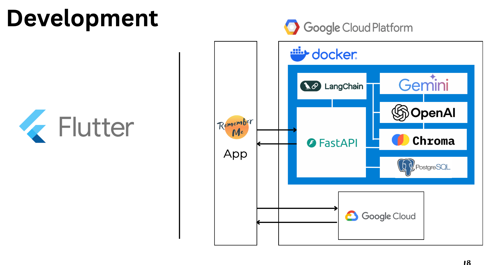

# The Bridge Hackathon - 국제 해커톤 회고

올해 2025년 5월 17-18일, 무박 2일로 일본 도쿄에서 열린 The Bridge Hackathon 2025에 다녀왔습니다.

연세대 GDG, 고려대 GDG, 도쿄대 GDG, 와세다대 GDG 총 4개 학교 GDG 챕터가 함께한 국제 해커톤이었는데,

Code Chrysalis라는 일본의 부트캠프 공간에서 진행되었습니다.

결과적으로 우리 팀이 대상을 받았었는데 느낀 바를 좀 적어봤습니다.

## 팀 빌딩

우리 팀은 총 5명으로 구성되었는데, 생각해보니 일본인은 한 명도 없었습니다.

와세다대학에서 대만인 1명과 일본 유학 온 한국인 1명, 고려대에서 중국인 1명과 한국인 1명(저), 연세대에서 한국인 1명이었습니다.

주제는 따로 정해진 것 없이 자유였고, 구글 후원을 받은 해커톤이라 Gemini를 사용해야 한다는 조건만 있었습니다.

우리가 개발한 것은 'RememberMe'라는 치매 환자를 위한 AI 기반 메모리 컴패니언 앱이었습니다.

음성이나 이미지를 업로드하면 AI가 개인화된 기억 단서를 제공하는 방식으로, 고령화 사회 문제에 대한 실질적인 해결책을 제시하고자 했습니다.

## 개발 과정

개발 분담은 제가 Flutter 앱 개발을 전담했고,다른 팀원들이 백엔드, AI, 기획, 디자인을 나눠서 맡았습니다.

백엔드 경험도 있어서 동료가 어려워하는 부분을 도와주고, 마지막엔 Docker로 배포까지 했습니다.

다행히 주어진 시간 안에 실제로 작동하는 앱을 완성할 수 있었고, 이 점을 심사위원분들이 높게 평가해주셨던 것 같습니다.

개인적인 의견으로는, 전체적인 개발 실력은 한국 대학 친구들이 일본 대학 친구들보다 더 나은 것 같았습니다.

## 언어

평소에는 영어 회화를 따로 공부해야겠다는 생각이 없었는데, 이번 해커톤에 참가하면서 정말 절실하게 느꼈습니다.

기술적인 토론보다는 일상적인 대화에서 더 어려움을 겪었습니다.

서로 공감대를 형성하며 친해지려면 내 얘기나 상대방 얘기에 적절하게 반응해야 하는데, 그런 부분에서 아쉬움이 많았습니다.

특히 대만 팀원을 보니 영어도 잘하고, 한국어도 어느 정도 알아듣고, 중국어는 당연히 잘하니까 정말 대단하더라구요.

발표도 그 친구가 맡아서 잘 해줬습니다.

나이도 상당히 어린 친구였었는데, 역시 나이보다 중요한건 그 사람이 살아온 경험이 중요하구나 생각이 또 들었습니다.

연세대 친구는 영어 표현 자체는 저랑 비슷한 수준이었는데,

붙임성이 엄청 좋아서 금방 사람들과 친해지는 게 대단했습니다.

저는 영어 말하기에 약간 두려움을 가지고 있어서 그런 게 쉽지 않더라구요.

## 멘토링

가장 인상 깊었던 건 Brian이라는 멘토와의 만남이었습니다. 연세대 의대를 나오셨는데 실리콘밸리에 가서 창업하신 분이었습니다.

거의 native 수준으로 영어를 구사하시더라구요.

표현력도 그렇고 발음도 좋으셔서 부러웠습니다.

의사라는 안정적인 길을 두고 어떻게 스타트업을 하게 되셨는지, 한계점은 없었는지,

실리콘밸리 생활은 어떤지 궁금한 게 많았고, 멘토링 시간에 몇가지를 물어봤습니다.

가장 인상깊었던 건 "스타트업을 할거면 무조건 실리콘밸리를 가라"고 하신 말씀이었습니다.

거기 있는 사람들에게서 받는 영감과 동기부여, 트렌드의 최전선에 있다는 경험 자체가 엄청 소중하다고 하셨습니다.

제가 개발한 모습과 실제로 스타트업을 2년간 진행해서 프라이머 투자까지 받았다는 점을 좋게 봐주셨는지,

졸업하고 실리콘밸리 올 생각 없냐고 물어봐주시기도 했습니다.

빈말인지도 모른다는 생각이 들기도 했지만 실리콘밸리가 그리 멀지 않다는 느낌이 확 다가와서 앞으로의 기회를 더 열어두기 위해서라도 영어 회화를 연습해야겠다는 생각이 더 들었습니다.

## 네트워킹의 아쉬움

사실 영어 실력이 부족했던 건 해커톤이 끝나고 네트워킹하는 과정에서 더 크게 느꼈습니다.

개발에 집중하느라 발표 준비까지 할 시간이 없었고, 결과적으로 다른 사람들과 더 깊은 대화를 나눌 기회를 놓친 것 같습니다.

영어 말하기에 대한 두려움도 있었구요. 이런 부분은 연습을 통해 계속 해나가야 하는 부분이라고 생각합니다.

## 마무리

이번 해커톤을 통해서 대상이라는 좋은 결과도 얻었지만,

그보다 더 큰 수확은 영어 회화의 중요성을 절실히 깨달은 것 같습니다.

앞으로 더 많은 기회들이 있을 텐데,

그때마다 언어 때문에 제약을 받고 싶지는 않다는 생각을 하게 되었습니다.

기술 실력도 중요하지만, 그것을 제대로 어필하고 사람들과 소통할 수 있는 능력도 그에 못지않게 중요하다는 걸 배워갑니다.

