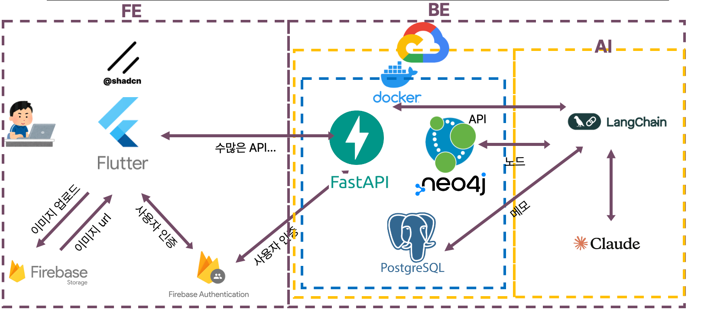

# NEXT 공모전 1인 개발기

올해(25년도) 고려대학교 정보대학에서 열린 NEXT 공모전에 1인 개발로 참가해서 메모리아라는 AI 기반 지식관리 앱을 개발했습니다. 

평소에 AI API를 활용한 서비스를 만들어보고 싶다는 생각을 해왔었는데, 

이번 기회에 제대로 도전해볼 수 있어서 정말 흥미로운 경험이었습니다.

결과적으로 동상을 받아 상금 50만원을 받았지만, 그보다는 개발 과정 자체가 재미있는 경험이었던 것 같습니다.

## 메모리아

메모리아는 단순한 메모 앱이 아니라 AI 기반의 개인화된 지식 관리 시스템인데,

사용자가 작성한 메모와 이미지를 그래프 형태로 연결해서 저장하고, RAG를 통해 AI 질의응답을 제공하는 앱 입니다.

⬆️ AI 질의응답

핵심 아이디어는 제텔카스텐의 '상향식' 지식 구축 철학을 디지털 환경에 적용하는 것이었습니다.

기존 대부분의 지식 그래프 시스템이 초기에 대규모 데이터 세트를 필요로 하는 것과 달리, 사용자의 개별 메모부터 시작해서 점진적으로 의미 있는 지식 구조를 구축하는 방식으로 접근했습니다.

## 기술 스택

프론트엔드로는 Flutter를 선택했습니다.

추후 모바일 지원을 고려해서 크로스플랫폼 개발이 가능한 걸로 골랐고,

복잡한 그래프 시각화와 인터랙션을 구현하기에도 적합했습니다.

firebase로 authentication을 구현했고, firebase storage를 이용해서 이미지를 저장했습니다.

백엔드는 FastAPI와 PostgreSQL을 사용했습니다.

빠른 개발을 위해 FastAPI를 선택했고,

안정적인 데이터 저장을 위해 PostgreSQL을 사용했습니다.

그래프 데이터베이스로는 Neo4j를 선택했는데, graphdb를 검색하면 제일 먼저 나오더군요.

배포는 GCP에 했는데, 이유는.. 저렴해서 입니다.. ㅋㅋㅋ

aws는 가격이 좀 비싸더군요.

현재는 연세대 Organizer에게 소개받은 oracle 클라우드를 사용중입니다. (이건()

AI API는 Claude Sonnet을 모든 LLM 작업에 사용했습니다.

Langchain은 llm을 다루는 데에 사용했습니다.

지금 생각해보면 task별로 다른 모델을 사용하거나 일부는 rule-based로 처리하면 비용 최적화와 성능 향상이 가능했을 것 같습니다.

## RAG 구축

가장 까다로웠던 부분은 사용자의 질의에서 Neo4j 쿼리를 자동 생성하는 부분이었습니다.

Claude가 자꾸 실제로 존재하지 않는 Neo4j 함수를 사용하거나,

문법적으로 잘못된 쿼리를 작성하는 문제가 빈번했습니다.

이를 해결하기 위해 retry 로직으로 fail-proof를 구현하고,

Neo4j 쿼리에 대해 공부해서 실제 사용할 쿼리 템플릿을 미리 작성했습니다.

그리고 프롬프트 엔지니어링으로 해당 형식을 채우는 방식으로 변경했더니 훨씬 안정적인 쿼리 생성이 가능해졌습니다.

또, 처음엔 사용자의 질의를 그대로 RAG에 넘겨주는 방식이었는데, 원하는 내용을 제대로 가져오지 못하는 문제가 있었습니다.

그래서 사용자의 질의를 여러 단계로 쪼개서 키워드를 추출하거나 핵심적인 내용을 파악하는 LLM을 따로 두고,

해당 키워드와 내용을 이용해서 프롬프트를 작성하니 성능이 확실히 향상되었습니다.

## GraphDB

일반적인 벡터 DB만 사용하는 RAG 시스템과 달리,

Neo4j 그래프 데이터베이스를 활용해서 의미적 연결성과 구조적 관계를 AI 모델에 제공할 수 있었습니다.

사용자가 저장한 지식 정보만을 이용해서 답변하고 모르는 문제에 대해선 답변하지 않도록 했기 때문에 환각 현상을 크게 없앨 수 있습니다.

또, 새로운 노드 추가 시 기존 그래프와의 관계를 자동으로 분석하고 연결하는 알고리즘을 구현했습니다. 덕분에 초기에는 단순한 메모 관리 도구로 시작하지만, 사용이 누적될수록 초개인화된 지식 저장소로 성장하는 시스템을 만들 수 있었습니다.

## 사용기

개발하면서 직접 사용해보니 그래프 시각화와 인터랙션이 만족스러웠습니다.

내가 작성한 메모들이 의미 있게 연결되어 보이는 모습이 신기했고,

AI가 내 메모를 바탕으로 정확한 답변을 해주는 게 정말 만족스러웠습니다.

지식이 쌓여가는 모습을 볼 수 있다는게 제일 좋았던 것 같습니다.

## 결론

다른 팀들은 디자이너, AI 전문가, 백엔드, 프론트엔드가 파트별로 나뉘어져 있었는데, 각 분야의 전문성이 확실히 차이가 났습니다.

특히 AI 활용 부분에서 전문적인 지식을 가진 팀원이 있는 게 큰 도움이 되는 것 같았습니다.

하지만 1인 개발로 진행하면서 전체 시스템을 일관성 있게 설계하고 구현할 수 있었던 점도 나름의 장점이었다고 생각합니다.

팀으로 개발했다면 소통 비용이나 의견 조율하는 시간도 만만치 않았을 테니까요.

### 아쉬운 점

크로스플랫폼으로 개발했음에도 불구하고 모바일 버전을 완성하지 못한 게 가장 아쉬웠습니다.

하필이면 일본 국제 해커톤, 구글 솔루션 챌린지, 학기가 겹치는 바람에 원했던 기능 몇 개를 구현하지 못했습니다. 

또한 공모전에서 요구하는 보고서 작성과 발표 자료 제작이 생각보다 시간을 요하는 작업이었던 부분이 걸렸습니다.

특히 디자인 철학에 대해 써야 하는 부분이 있었는데, 평소에 느낌대로 개발하는 경향이 있어서 이를 체계화해서 설명하는 게 쉽지 않았습니다.

지금 돌이켜보면 기술적으로 개선할 점들이 보입니다.

모든 작업에 Claude Sonnet을 사용할 필요는 없었을 것 같습니다.

간단한 키워드 추출이나 분류 작업은 더 가벼운 모델이나 rule-based 시스템으로도 충분했을 것 같습니다.

다행히 Claude API 비용이 생각보다 적게 나왔지만, 더 효율적인 프롬프트 설계나 캐싱을 도입했다면 더 좋았을 것 같습니다.

### 느낀 점

메모리아 프로젝트는 저에게 AI 기반 서비스 개발의 전체 과정을 경험할 수 있어서 재미있던 프로젝트였습니다.

RAG 시스템 구축부터 그래프 데이터베이스 활용, 프롬프트 엔지니어링까지...

책이나 강의에서만 접했던 개념들을 직접 구현해보면서 많은 것을 배울 수 있었습니다.

동상이라는 결과도 물론 기뻤지만 백엔드와 AI에 대한 경험 없이 LLM 모델들을 이용해서 이렇게까지 프로덕트를 만들 수 있다는 점이 재밌기도 하고 무서웠습니다.

앞으로 개발자로서의 역할에 대해 다시한번 생각해볼 수 있는 기회가 됐습니다.

아래 링크는 공모전에 제출했던 demo 영상입니다. 관심 있으시면 한번 시청해보시면 재미있을 것 같습니다!

[https://www.youtube.com/watch?v=KC8OYSi0FkI](https://www.youtube.com/watch?v=KC8OYSi0FkI)