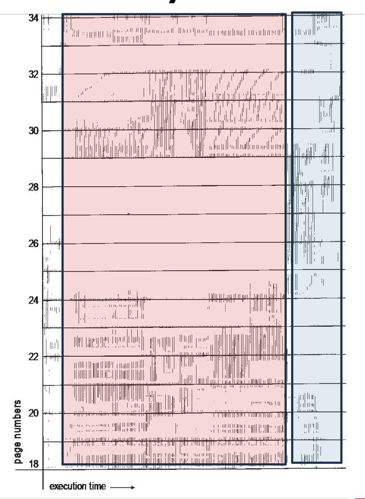

# 캐시

캐시는 기본적으로 메모리와 cpu 간의 시간 차이 때문에 생기는 병목을 해소하고자 나온 개념입니다.

cpu가 책을 읽는다고 했을 때, 책을 읽을 때마다 도서관(메모리)에 가서 책을 가져오면 시간이 너무 오래 걸리니,

한번에 많은 책을 가져와서 집의 책장에다 꽂아두는 느낌인 것이죠.

참고로 이 비유는 컴퓨터 구조 수업에서 교수님께서 들어주셨던 비유인데, 똑같이 책에서 나와서 이게 일반적으로 많이 쓰는 비유법이구나 싶었습니다.. ㅋㅋㅋ

마치 class를 붕어빵 틀로 비유하는 것 같은 느낌일까요?


종종 amd의 cpu 중에서 5800x3d, 7800x3d .. 같이 ~x3d같은 이름을 붙인 제품을 보셨을 수도 있습니다.

이 제품들은 3D v-cache로, 64MB의 L3캐시를 수직으로 더 쌓아올린 제품들인데, 여기의 L3캐시가 바로 캐시입니다.

일반적으로 같은 데이터를 반복적으로 사용하는 게임에서 캐시 히트율을 높일 수 있어서 게임에서 프레임을 올릴 수 있다고 알려져 있습니다.


## temporal locality, spacial locality

cs를 공부하게 되면 반드시 한번 이상을 알게 되는 개념입니다.



지역성의 원칙인데, 각각 한번 접근했던 메모리 조각에 다시 접근하는 경우, 한 메모리 조각을 참조하면 주변의 다른 메모리 조각에 접근하는 경우에 해당합니다. 위의 이미지는 locality를 극명하게 보여주는 사례입니다.

이 때문에 메인 메모리로부터 캐시로 메모리를 복사 해 올때 주변 메모리 주소까지 복사해오고, 캐시가 가득 찼을 떄 가장 오래전에 사용했던 메모리 조각을 폐기하는 방식으로 동작하는 것이죠.


## 캐시 동기/일관성

한편 locality 개념 외에도 메모리의 일관성 문제가 불거지는데, 

다중 코어가 cpu에서 등장하기 시작했고, 캐시를 갱신 할 경우 메모리와는 불일치하는 문제가 발생했기 때문입니다.

이를 해결하기 위한 방식이 write-through와 write-back 방식이 있는데, 각각 동기 방식과 비동기 방식입니다.

동기 방식은 메모리가 갱신될 때까지 대기하고 있어야 하므로 write-back방식이 분명히 성능이 더 낫습니다.


## 캐시 친화적 프로그램

locality 개념을 특히 더 살리는 코드를 작성하는 건데,

malloc/new 같은 일반적인 상황에서 메모리 할당자를 사용하여 N개 할당해야 하는 경우, 메모리 조각이 힙 영역의 이곳 저곳에 흩어져 있을 수 있기 때문에 공간적 지역성 측면에서 캐시에 불리합니다.

이런 경우엔 메모리 풀 기술을 사용할 수 있습니다. 커다란 메모리 조각을 할당을 먼저 받은 뒤에 user space에서 해당 메모리 조각을 다루기 때문입니다.

또한 다음과 같은 연결 리스트 코드는..

```c
#define SIZE 10000

struct LIST
{
  LIST* next;
  int arr[SIZE];
  int value;
};
```

탐색 과정에서 arr값 이외에 value값만 비교하고 탐색 할 경우,

탐색 중 사용하는 항목은 `next` 포인터와 `value` 값입니다.

하지만 이 값이 `arr` 에 의해 멀리 떨어져 있기 때문에 공간적 지역성이 나빠질 수 있습니다.


```c
#define SIZE 10000

struct LIST
{
  LIST* next;
  int value;
  int arr[SIZE];
};
```

따라서 위와 같이 변경하면 공간적 지역성을 활용할 수 있으며,

더 나아가서 핫 데이터(빈번하게 접근하는 데이터) 콜드 데이터(접근 빈도가 낮은 데이터)를 분리하여 캐시 친화적인 코드를 작성할 수 있습니다.


```c
#define SIZE 10000

struct LIST
{
  LIST* next;
  int value;
  int Arr* arr;
};

struct Arr
{
  int arr[SIZE];
}
```


하지만 저자도 강조하는 것은, 이런 최적화를 할 때에는 분석 도구를 사용해서 캐시의 적중률이 병목사항인지 아닌지를 먼저 판단해야 한다고 합니다.

사실 병목이 되지 않으면 위의 코드가 보기에도 좋고 유지관리하기 편한데, 굳이 필요 없다면 최적화를 할 필요는 없어 보입니다.


### 멀티 스레드: 캐시 튕김

보통 L1캐시와 L2캐시는 core별로 존재하며, L3캐시만을 공유합니다.

때문에 두개의 코어가 하나의 변수를 캐시 내에서 보고 있다고 할 지라도 다른 값을 가지고 있을 수 있습니다.

때문에 다른 코어에서 같은 변수를 쓸 때에 다른 캐시를 무효화해 주어야 합니다.

서로 다른 스레드에서 캐시 무효화를 하는 경우를 캐시 튕김이라고 합니다.


비록 같은 변수가 아닐지라도 캐시는 spacial locality를 살리기 위해서 cache line을 통째로 복사 해 옵니다. 

비록 스레드 두 개가 어떤 데이터도 공유하지 않는 것 처럼 보이더라도 캐시의 동작 방식에 따라서

캐시 라인을 공유할 가능성이 있습니다. 이를 false sharing이라고 합니다.


## lock-free programming

사실 이 부분은 읽으면서 제대로 이해를 하진 못했습니다.

compile을 하면서 서로 independent한 instruction은 최적화를 위해 실행 순서를 변경하는 경우가 있고,

cpu에서 실제로 실행 될 때도 순서를 변경하여 실행되는 경우가 있다고 합니다.

해당 부분은 실제로 컴파일이 어떻게 되는지, cpu 아키텍처가 어떻게 되는지에 따라서 다르며

다양한 cpu아키텍쳐에서 돌아가는 프로그램을 작성 하려면 해당 부분을 이해 하고 있어야 한다고 합니다.

메모리 장벽 유형 `LoadLoad`, `StoreStore`, `LoadStore`, `StoreLoad`의 개념과 함께 획득-해제 의미론에 대한 설명을 잘 해주고 있었습니다.


사실 캐시는 컴퓨터 구조 수업에서 비교적 가볍게 배웠던 내용이라 모르는것도 많고

궁금했던 부분도 있었는데, 이 책이 가려웠던 부분을 시원하게 긁어줄 수 있었던 것 같습니다.


# 입출력 IO

CPU는 IO디바이스를 다루기 위해서 디바이스에 할당되는(매핑되는) 메모리에 읽고 쓰기를 통해 처리합니다.

NIC이 될 수도 있고, 키보드, 마우스가 될 수도 있습니다.

실제로 입출력을 구현하는 방식에는 polling과 interrupt방식 두가지가 있는데,

polling은 그냥 쭉 지켜보고있는 일종의 동기식 방법이며 interrupt 방식은 일종의 비동기 방식이라고 볼 수 있습니다.

하드웨어 level에서 인터럽트를 감지하여 ISR(Interrupt Service Routine)을 실행하여 IO를 처리할 수 있습니다.


## DMA

단순히 디스크나 ssd에 cpu가 메모리를 복사하는 작업이 어떻게 보면 cpu의 자원을 제대로 활용하지 못하는 작업이기 때문에 복사하는 작업을 다른 하드웨어에게 위임할 수 있습니다.

DMA(Direct Memory Access)가 그 하드웨어인데, 데이터를 순수하게 복사하는 작업만을 수행하고 수행을 끝마친 뒤

cpu에게 INT를 날려서 작업이 끝났다고 처리를 하는 방식입니다.

이를 통해 효율적으로 메모리 복사를 수행할 수 있습니다.


## 모든것이 파일

리눅스의 핵심 철학 중 하나는 "Everything is a file"입니다.

IO 디바이스부터 프로세스 정보, 심지어 소켓까지도 파일처럼 다룰 수 있죠.

모두 단순한 `read`, `write` 시스템 콜로 다룰 수 있습니다.


## mmap

여기서 등장하는 것이 `mmap`입니다. 파일의 내용을 직접 프로세스의 가상 메모리 공간에 매핑시키는 기술입니다.


기존 방식:

```c
fd = open("large_file.dat", O_RDWR);
buffer = malloc(file_size);
read(fd, buffer, file_size);
buffer[index] = new_value;
write(fd, buffer, file_size);
```

mmap 방식:

```c
ptr = mmap(NULL, file_size, PROT_READ|PROT_WRITE, 
           MAP_SHARED, fd, 0);

ptr[index] = new_value; 
```

mmap을 사용하면 파일 데이터가 프로세스 메모리 공간에 직접 매핑되므로, 별도의 메모리 복사 과정이 필요 없습니다.

파일에 읽고 쓰는 것을 마치 메모리를 읽고 쓰듯이 사용할 수 있는게 장점입니다.


실제로 user application을 작성할 때에도 사용할 수 있지만,

동적 라이브러리를 사용할 때에도 mmap을 통해서 링킹됩니다.

거의 모든 프로그램은 `libc.so`(c 표준 라이브러리)를 사용할 텐데, 마찬가지로 `mmap`을 이용해서 프로세스의 주소 공간에 매핑됩니다.


## 컴퓨터 시스템에서의 지연

되게 흥미로웠던 부분 중 하나인데, 제프 딘이 제시한 통계 자료를 언급 해 주었습니다.


책의 자료는 2012년의 자료인데, 2020년에 새로 리뉴얼이 되었습니다.

컴퓨터 시스템의 주요 작업에서 발생하는 지연 시간을 볼 수 있는데,

일반적으로 우리가 1ns를 체감하기 힘들기 때문에 책에서 비유를 더 해주었습니다.

L1 캐시의 접근 지연시간이 1초라고 가정하면, 메모리 접근 지연시간은 3분이며,

캘리포니아에서 네덜란드까지 패킷 roundtrip을 보면 7년 이라고 합니다.


이걸 보니 cpu의 사이클이 얼마나 짧으며, 제가 작성하는 코드가 얼마나 추상회되어있는지가 더 실감이 되었습니다.

사람이 1년간 작성할 수 있는 코드가 AI는 10분이면 작성할 수 있다고 얘기하는 것이 문득 떠올랐습니다.

그만큼 컴퓨터가 강력한 도구고, 잘 활용하는것이 중요하겠다는 생각이 들었습니다.


## 후기

이렇게 컴퓨터 밑바닥의 비밀 이라는 책을 다 읽고 내용도 정리해서 블로그에 글로 써 보았습니다.

처음에는 그냥 읽고 말아버려야지 하겠다는 생각이었는데, 1-2장을 정리해서 써 보고 나니 

훨씬 더 머리속에서 정리가 되는 기분이었습니다.


1년 전 쯤 들었던 운영체제와 컴퓨터 구조 수업 내용이 책에 녹아들어 있었고,

분명 수업 자료보다야 비유적인 표현, 이해하기 쉬운 표현들과 추상화가 많이 되어있었지만

해당 수업에서 교수님이 얼마나 잘 가르쳐 주셨는지 다시 한번 깨닫게 되는 순간이었습니다.


컴퓨터 언어부터 해서 실제로 우리가 다루는 컴퓨터가 어떻게 만들어 졌는지,

어떻게 굴러가고 있는지와 더불어서 실용적인 기술(메모리풀, 스레드 안전 코드) 까지 다루니 

컴퓨터 공학을 전공하고 있는 학생이라면 읽어보면 분명히 도움이 되지 않을까 싶습니다.


책 중간 중간에 그려져 있는 삽화, 그림, 적절한 비유는 cs에 아얘 지식이 없는 사람이 아니라면

충분히 이해를 도울 수 있는 내용들로 채워져 있었습니다. 

최근에 방학을 한 이후로 전공 서적을 읽을 일이 많진 않았는데 공백을 채워주는 느낌이었습니다.


이 책을 기꺼이 빌려준 성진 선배에게 감사하며..


