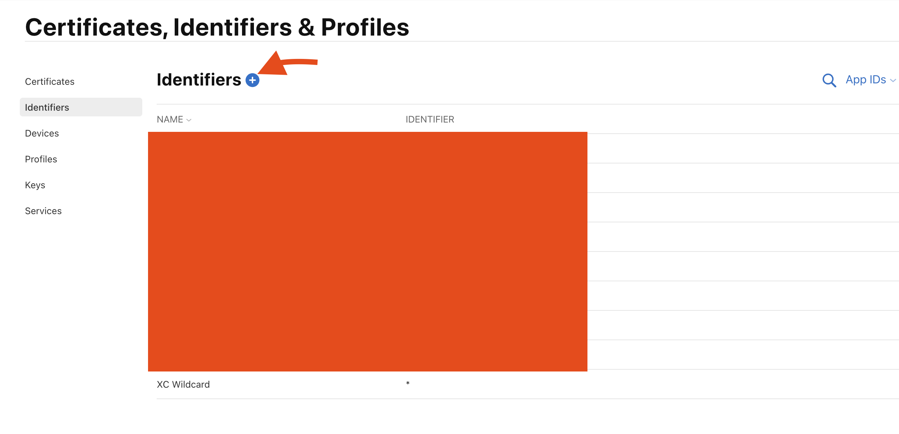
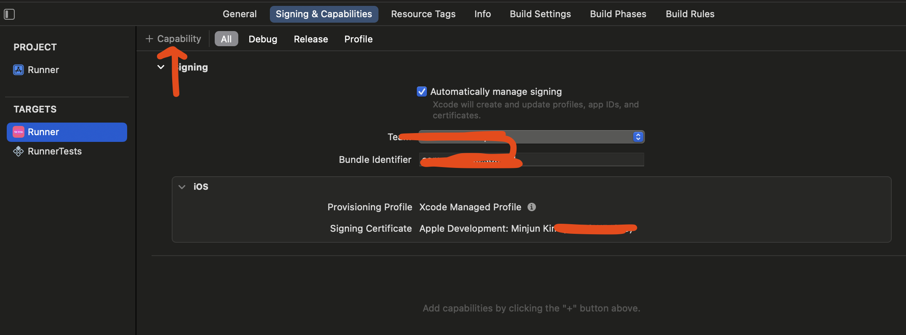
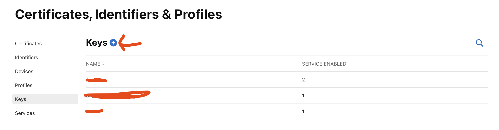
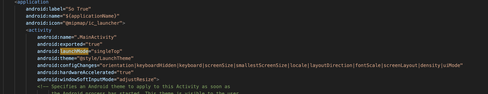

https://developer.apple.com/account/resources/identifiers/list

https://pub.dev/packages/sign_in_with_apple



#### Register an App ID

If you don't have one yet, create a new one at https://developer.apple.com/account/resources/identifiers/list/bundleId following these steps:

- Click "Register an App ID"

- In the wizard select "App IDs", click "Continue"

- Set the

   

  ```
  Description
  ```

   

  and

   

  ```
  Bundle ID
  ```

  , and select the

   

  ```
  Sign In with Apple
  ```

   

  capability

  - Usually the default setting of "Enable as a primary App ID" should suffice here. If you ship multiple apps that should all share the same Apple ID credentials for your users, please consult the Apple documentation on how to best set these up.

- Click "Continue", and then click "Register" to finish the creation of the App ID

In case you already have an existing App ID that you want to use with Sign in with Apple:

- Open that App ID from the list
- Check the "Sign in with Apple" capability
- Click "Save"





#### Create a Service ID

The Service ID is only needed for a Web or Android integration. If you only intend to integrate iOS you can skip this step.

Go to your apple developer page then ["Identifiers"](https://developer.apple.com/account/resources/identifiers/list) and follow these steps:

Next go to https://developer.apple.com/account/resources/identifiers/list/serviceId and follow these steps:

- Click "Register an Services ID"
- Select "Services IDs", click "Continue"
- Set your "Description" and "Identifier"
  - The "Identifier" will later be referred to as your `clientID`
- Click "Continue" and then "Register"

Now that the service is created, we have to enable it to be used for Sign in with Apple:

- Select the service from the list of services
- Check the box next to "Sign in with Apple", then click "Configure"
- In the `Domains and Subdomains` add the domains of the websites on which you want to use Sign in with Apple, e.g. `example.com`. You have to enter at least one domain here, even if you don't intend to use Sign in with Apple on any website.
- In the `Return URLs` box add the full return URL you want to use, e.g. https://example.com/callbacks/sign_in_with_apple
- Click "Next" and then "Done" to close the settings dialog
- Click "Continue" and then "Save" to update the service




In order to communicate with Apple's servers to verify the incoming authorization codes from your app clients, you need to create a key at https://developer.apple.com/account/resources/authkeys/list:

- Click "Create a key"
- Set the "Key Name" (E.g. "Sign in with Apple key")
- Check the box next to "Sign in with Apple", then click "Configure" on the same row
- Under "Primary App ID" select the App ID of the app you want to use (either the newly created one or an existing one)
- Click "Save" to leave the detail view
- Click "Continue" and then click "Register"
- Now you'll see a one-time-only screen where you must download the key by clicking the "Download" button
  - Also note the "Key ID" which will be used later when configuring the server

### LaunchMode



To ensure that deep links from the login web page (shown in a Chrome Custom Tab) back to the app still work, your app must use `launchMode` `singleTask` or `singleTop`


In your `android/app/src/main/AndroidManifest.xml` inside `<application>` add

```xml
<activity
    android:name="com.aboutyou.dart_packages.sign_in_with_apple.SignInWithAppleCallback"
    android:exported="true"
>
    <intent-filter>
        <action android:name="android.intent.action.VIEW" />
        <category android:name="android.intent.category.DEFAULT" />
        <category android:name="android.intent.category.BROWSABLE" />

        <data android:scheme="signinwithapple" />
        <data android:path="callback" />
    </intent-filter>
</activity>
```


#### Your App

- First and foremost make sure that your app has the "Sign in with Apple" capability (`Runner` (file browser side bar) -> `Targets` -> `Runner` -> `Signing & Capabilities`), as otherwise Sign in with Apple will fail without visual indication (the code will still receive exceptions)
- Either integrate the example server as shown above, or build your own backend
  - Ensure that the `clientID` used when validating the received `code` parameter with Apple's server is dependent on the client: Use the App ID (also called "Bundle ID" in some places) when using codes from apps running on Apple platforms, and use the service ID when using a code retrieved from a web authentication flow


```dart
SignInWithApple.getAppleIDCredential(
    scopes: [],
    webAuthenticationOptions: WebAuthenticationOptions(
      clientId: "com.nanonae.sotrueservice",
      redirectUri: Uri.parse("https://example.com/test"),
    ),
  ).then((value) async {
    final token = value.identityToken;
    if (token == null) {
      return AuthResult.appleFail();
    }
    return serverOauthLogIn(token, LoginMethod.apple);
  }).catchError((e) {
    log("Apple login failed: $e");
    SimpleNotify().show("Failed to login with Apple");
    return AuthResult.appleFail();
  });
```

